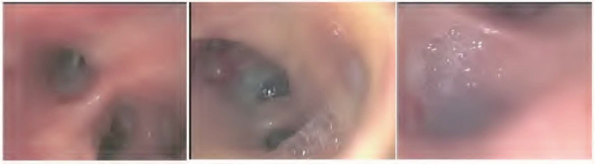
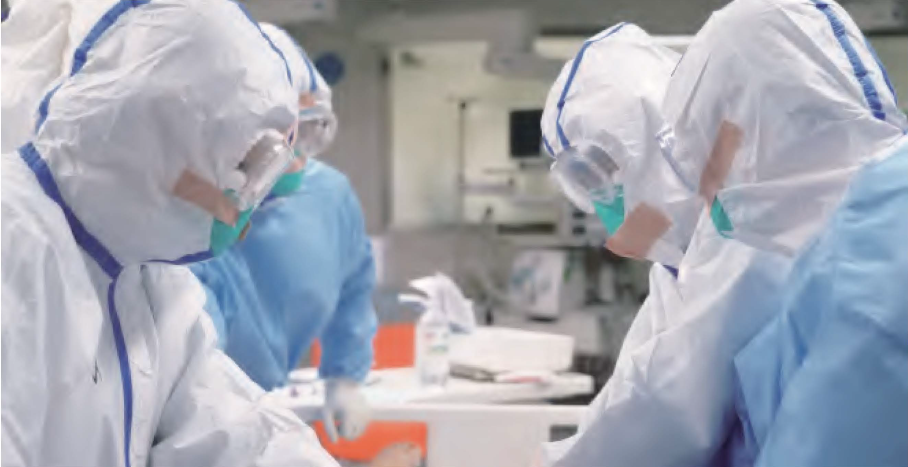

# Diagnóza a léčba

## Personalizovaný a multidisciplinární management

FAHZU je nemocnice speciálně určená pro pacienty s onemocněním COVID-19, především pro závažné a kritické případy jedinců, jejichž stav se rychle mění, často mají infekcí poškozené různé orgány a vyžadují péči multidisciplinárního týmu. Po vypuknutí epidemie ustanovila nemocnice FAHZU expertní tým sestávající z lékařů z oddělení infekčních nemocí, respirační medicíny, JIP, laboratorní medicíny, radiologie, ultrazvukových metod, farmacie, tradiční čínské medicíny, psychologie, respirační terapie, rehabilitace, výživy, ošetřovatelství atd. Byl stanoven komplexní multidisciplinární mechanismus diagnostiky a léčby, podle kterého mohou lékaři na infekčním oddělení i mimo něj každý den prostřednictvím videokonferencí projednávat stav pacientů. To jim umožňuje určit optimální léčebnou strategii pro každý závažný a kritický případ.

Pro diskuzi multidisciplinárního týmu je klíčové racionální rozhodování. Během diskuze se odborníci z různých oddělení zaměřují na problém ze svého oboru i na kritické aspekty diagnózy a léčby. Konečné rozhodnutí o léčbě určují zkušení odborníci na základě prodiskutování různých možností a doporučení. Středem diskuze multidisciplinárního týmu je systematická analýza. Starší pacienti a zejména ti s přidruženými onemocněními jsou náchylní ke kritickým stavům.

Při sledování postupu onemocnění COVID-19 by se současně měl komplexně analyzovat pacientův celkový stav, komplikace a aktuální výsledky vyšetření, aby bylo možné určit , jak bude nemoc postupovat. Je nutné s předstihem zasáhnout proti zhoršení onemocnění a zahájit preventivní opatření jako podání antivirotik, kyslíková terapie a nutriční podpora.

Cílem diskuze multidisciplinárního týmu je najít personalizovanou léčbu. S ohledem na rozdíly mezi jednotlivci, průběhem nemoci a typy pacientů by měl být plán léčby každému pacientovi uzpůsoben.

Podle naší zkušenosti může spolupráce v rámci multidisciplinárního týmu velkou měrou zvýšit efektivitu diagnostiky a léčby COVID-19.

## Etiologie a indikátory zánětu

### Detekce nukleové kyseliny SARS-CoV-2

#### Odběr vzorků

Ke zlepšení senzitivity detekce jsou důležité správné vzorky, metody odběru a jejich načasování. Mezi vzorky patří: vzorky z horních cest dýchacích \(orofaryngeální výtěr, výtěr z nosu, výtěr z nasofaryngeálního sekretu\), vzorky z dolních dýchacích cest \(hlen, sekrety dýchacích cest, bronchoalveolární laváž\), z krve, stolice, moči a spojivkového sekretu. Hlen a další vzorky z dolních cest dýchacích mají vysokou míru pozitivity nukleové kyseliny a měly by být odebírány přednostně. SARS-CoV-2 přednostně proliferuje na alveolárních buňkách II. typu \(AT2\) a šíření viru dosahuje vrcholu 3--5 dní po vypuknutí nemoci. Proto, pokud je test na nukleovou kyselinu ze začátku negativní, v dalších dnech by měly být odebrány a testovány další vzorky.

#### Detekce nukleové kyseliny

Preferovanou metodou diagnostikování infekce SARS-CoV-2 je testování přítomnosti nukleové kyseliny. Podle pokynů na testovací sadě je proces testování následující: Vzorky jsou pre-procesovány, virus se rozpadne a extrahují se nukleové kyseliny. Poté se kvantitativní PCR technologií v reálném čase \(RT-PCR\) amplifikují tři geny specifické pro SARS-CoV-2, konkrétně otevřený čtecí vzorec 1a/b \(ORF1a/b\), nukleoprotein \(N proteiny\) a E proteiny. Amplifikované geny verifikujeme na základě určení intenzity fluorescence. Kritéria pozitivního výsledku na nukleovou kyselinu jsou:

ORF1a/b gen je pozitivní, a/nebo N gen/E gen jsou pozitivní.

Kombinovaná detekce nukleových kyselin z několika typů vzorků může zlepšit diagnostickou přesnost. Mezi pacienty s potvrzenou pozitivní nukleovou kyselinou v dýchacím traktu byla u 30-40 % z nich virová nukleová kyselina zjištěna v krvi a u 50-60 % ve stolici. Míra pozitivity nukleové kyseliny testované v moči je ale celkem nízká. Kombinované testování vzorků z dýchacího traktu, stolice, krve a dalších biologických materiálů pomáhá zlepšovat diagnostickou senzitivitu u suspektních případů, monitorovat účinnost léčby a management izolačních opatření po propuštění.

### Izolace a kultivace viru

Kultivace viru musí být provedena v kvalifikované laboratoři s úrovní biologické bezpečnosti 3 \(BSL-3\). Ve stručnosti je postup následující: Čerstvé vzorky jsou získány z hlenu, stolice atd. pacienta a naočkovány do Vero E6 komůrek ke kultivaci viru. Cytopatický efekt \(CPE\) je pozorován po 96 hodinách. Detekce virové nukleové kyseliny v médiu indikuje úspěšnou

kultivaci. Titr viru: Po sérii ředění koncentrace viru s faktorem 10 je mikro cytopatickou metodou stanovena TCID50. Jinak se životaschopnost viru zjistí podle plak tvořící jednotky \(PFU\).

### Detekce sérových protilátek

Po infekci SARS-CoV-2 jsou vytvářeny specifické protilátky. Metody pro určení sérových protilátek zahrnují imunochromatografii se značením koloidním zlatem, ELISA, imunologický chemiluminescenční test atd. ≥4krát vyšší specifické IgM protilátky v séru nebo specifické IgG protilátky ve fázi uzdravování oproti akutní fázi je možné použít jako diagnostické kritérium u suspektních pacientů s negativní detekcí nukleové kyseliny. Při sledování je IgM detekovatelný 10 dní po nástupu symptomů a IgG 12 dní po nástupu symptomů. Virová zátěž postupně klesá se zvyšujícími se hladinami protilátek v séru.

### Indikátory detekce zánětlivé reakce

Doporučuje se provést odběry na C-reaktivní protein, prokalcitonin, feritin, D-dimery, celkový počet i subpopulace lymfocytů, IL-4, IL-6, IL-10, TNF-α, TNF-y a další indikátory zánětu a stavu imunitního systému, což může přispět k hodnocení klinické progrese, upozornit na možné vážné a kritické stavy a poskytnout základ pro stanovení strategie léčby.

Většina pacientů s onemocněním COVID-19 má normální hladinu prokalcitoninu s výrazně vyššími hladinami C-reaktivního proteinu. Rychlá a významně zvýšená hladina C-reaktivního proteinu ukazuje na možnost sekundární infekce. Hladiny D-dimeru u závažných případů jsou výrazně vyšší, což je možný faktor špatné prognózy. Pacienti s nízkým celkovým počtem lymfocytů na začátku nemoci mají obecně špatnou prognózu. Pacienti ve vážném stavu mají postupně klesající počet lymfocytů v nátěru periferní krve. U vážných případů se výrazně zvyšují hladiny exprese IL-6 a IL-10. Sledování hladiny IL-6 a IL-10 je důležité k posouzení rizika progrese do závažného stavu.

### Detekce sekundární bakteriální nebo plísňové infekce

Pacienti ve vážném a kritickém stavu jsou náchylní k sekundárním bakteriálním a plísňovým infekcím. Z místa infekce by měly být odebrány adekvátní vzorky na bakteriální kultivaci a kultivaci plísní. Existuje-li podezření na sekundární infekci plic, měly by být odebrány vzorky z hlenu vykašlaného z plic, tracheálního aspirátu a bronchoalveolární laváže. U pacientů s vysokou teplotou by měla být včas odebrána krev. U pacientů s podezřením na sepsi se zavedeným katetrem by měly být provedeny odběry vzorků na kultivaci z periferní žíly nebo katetru. Doporučeno je společně s kultivací plísně provádět alespoň dvakrát týdně krevní G test a GM test \(glukanový a galaktomannanový test\).

### Bezpečnost v laboratoři

Ochranná opatření v rámci biologické bezpečnosti by měla být stanovena na základě různých úrovní rizika zkoušek. Personál by měl být chráněn v souladu s požadavky na ochranu v laboratořích BSL-3 na odběr vzorků z dýchacího traktu, detekci nukleové kyseliny a kultivaci viru. U biochemických, imunologických a dalších rutinních laboratorních testů by se měla dodržovat osobní ochrana podle požadavků BSL-2 na ochranu v laboratořích. Vzorky by měly být převáženy ve speciálních přepravních nádobách a boxech, které splňují požadavky na biologickou bezpečnost. Veškerý odpadní materiál by měl být přísně autoklávován.

## Radiologické nálezy u pacientů s COVID-19

Zobrazovací metody hrudních orgánů mají v diagnostice COVID-19, sledování účinnosti léčby a vyhodnocení možnosti propuštění pacienta významnou hodnotu. Preferovanou metodou je CT s vysokým rozlišením. U kriticky nemocných pacientů, kteří nejsou mobilní, má přínos přenosný rentgen. V den přijetí, nebo pokud se nedosáhne ideálního terapeutického účinku, se obvykle provádí výchozí vyšetření pacienta s COVID-19 pomocí CT, které se může po 2 až 3 dnech zopakovat. Pokud jsou symptomy stabilní nebo se po léčbě zlepší, CT hrudníku je možné znovu udělat po 5 až 7 dnech. U kriticky nemocných pacientů se doporučuje skiagram hrudníku pomocí mobilního přístroje.

V časných stádiích COVID-19 se na CT snímcích často objevují víceložiskové stíny nebo denzity mléčného skla v plicní periferii, v oblasti pohrudnice a obou dolních lalocích. Dlouhá osa léze je většinou paralelní s pohrudnicí. U některých denzit mléčného skla pozorujeme ztluštění interlobulárních sept a intralobulárního intersticia, které se zobrazuje jako subpleurální retikulace, „crazy paving", do češtiny volně přeloženo jako „obraz dlažby netříděnými kameny". V menším množství případů se mohou objevit samostatné lokální léze nebo uzlíky / skvrnité léze rozložené podél průdušek s periferními denzitami charakteru mléčného skla. Progrese nemoci se objevuje většinou v průběhu 7 až 10 dní, při čemž v porovnání s předchozími snímky je hustota lézí větší a objevují se konsolidované léze se vzdušným bronchogramem. U kritických případů se může objevit ještě závažnější konsolidace, přičemž hustota plic se zvyšuje a splývavé opacity pak mají až charakter „bílé plíce".

Po zlepšení stavu se denzity mléčného skla mohou úplně vstřebat a některé konsolidované léze zanechají fibrózní pruhy nebo subpleurální retikulace. Pacienti se zasaženými laloky, především ti s významnějšími lézemi, by měli být sledováni kvůli možnosti zhoršování intersticiálního procesu. Pacienti s typickými nálezy CT by měli být v izolaci a podstoupit další testy PCR i v případě, že mají test na nukleovou kyselinu SARS-CoV-2 negativní.

**Typické znaky COVID-19 na CT:**

* Obrázek 1 a 2: denzity mléčného skla
* Obrázek 3: uzlíkové ložiskové léze
* Obrázek 4 a 5: víceložiskové konsolidované léze
* Obrázek 6: difuzní konsolidace, „bílá plíce"

## Bronchoskopie v diagnostice a managementu pacientů s COVID-19

Flexibilní bronchoskopie je u pacientů s COVID-19 na plicní ventilaci všestranná, jednoduchá a dobře snášená metoda. Můžeme ji použít v následujících případech:

1. Na základě odběru vzorků z dolních dýchacích cest \(tj. hlen, endotracheální aspirát, bronchoalveolární laváž\) na SARS-CoV-2 nebo jiných patogenů můžeme vybrat antimikrobiální lék, který může mít klinický přínos. Podle našich zkušeností je větší pravděpodobnost pozitivity na SARS-CoV-2 u vzorků spíše z dolních dýchacích cest než z horních.

2. Je možné ji využít pro lokalizaci krvácení, zastavení hemoptýzy, odstranění hlenu nebo krevních sraženin. Je-li při bronchoskopii určeno místo krvácení, bronchoskopem je možné podat lokálně injekci studeného fyziologického roztoku, ředěného adrenalinu, vazopresinu nebo fibrinu nebo aplikovat léčbu laserem.

3. Při zajištění dýchacích cest může napomáhat při obtížné tracheální intubaci nebo perkutánní tracheostomii.

4. Pracovním kanálem bronchoskopu je možné podat léky jako interferon alfa nebo N-acetylcystein. Bronchoskopické vyšetření může diagnostikovat rozsáhlé bronchiální hyperémie sliznice, otoku, slizniční sekret v lumen a gelovitý hlen blokující dýchací cesty u kriticky nemocných pacientů \(Obrázek 7\).

**Obrázek 7:** Projevy COVID-19 při bronchoskopickém vyšetření: otok bronchiální sliznice a blokáda lumen bronchu, velké množství sekretu v bronchiálních cestách

## Diagnostika a klinická klasifikace COVID-19

Časná diagnostika, léčba a izolace by měly být zahájeny ihned, jak je to možné. Sledování dynamiky změn v zobrazovacích metodách plic, změn oxygenačního indexu a laboratorních hodnot cytokinů je dobrým vodítkem k časné diagnostice pacientů, kteří by mohli progredovat do vážného nebo kritického stavu. Pozitivita testu na nukleovou kyselinu SARS-CoV-2 je zlatým standardem pro diagnózu COVID-19. Nicméně, je třeba vzít v úvahu možnost falešné negativity testu , a tak pacienti s podezřením na onemocnění na podkladě charakteristických známek v CT zobrazení mohou být léčeni jako pacienti s potvrzenou nákazou i při negativitě testu nukleové kyseliny. U těchto pacientů by měla být zaveden izolační režim a měli by být opakovaně testováni.

Diagnostická kritéria jsou v souladu s Protokoly pro diagnostiku a léčbu COVID-2019. Potvrzení případu nákazy je založeno na epidemiologické anamnéze \(včetně komunitního přenosu infekce\), klinické manifestaci \(horečka a příznaky postižení dýchací soustavy\), zobrazovacích metodách a výsledcích odběrů SARS-CoV-2 nukleové kyseliny a specifických protilátek v séru.

### Klinická klasifikace

1. Lehký průběh

   Klinické symptomy jsou lehké a bez nálezu pneumonie na zobrazovacích metodách

2. Středně závažný průběh

   Pacienti mají symptomy jako například horečku nebo příznaky z postižení dýchacích cest, zároveň mohou být přítomny známky pneumonie na zobrazovacích metodách

3. Závažný průběh

   Dospělý pacient, který splňuje jakákoli z následujících kritérií - dechová frekvence větší nebo rovna 30 dechům/minutu; saturace kyslíkem menší nebo rovna 93% při měření v klidu; poměr parciálního arteriálního tlaku kyslíku \(PaO2\) ku frakci vdechovaného kyslíku \(FiO2\) menší nebo roven 300 mmHg. Pacienti s více než 50% progresí postižení plic během 24 až 48 hodin dle zobrazovacích metod by měli být léčeni jako pacienti se závažným průběhem onemocnění.

4. Kriticky závažný průběh

   Při splnění jakýchkoli z následujících kritérií: přítomnost respiračního selhání s nutností mechanické ventilace; přítomnost šokového stavu; jakékoli jiné orgánové selhání s nutností monitorace a léčby na jednotce intenzivní péče. Pacienti s kriticky závažným průběhem onemocnění jsou dále rozděleni do 3 fází - časné, střední a pozdní- dle oxygenačního indexu a plicní poddajnosti \(„compliance"\)

   * Časná fáze: oxygenační index 150 - 100 mmHg, compliance větší nebo rovna 30 mL/cmH2O; bez orgánového selhání kromě selhání respiračního. Takový pacient má velkou šanci na uzdravení při nasazení aktivní antivirové, anti - cytokinové a podpůrné terapie.
   * Střední fáze: oxygenační index 100 - 60 mmHg, compliance 30 - 15 mL/cmH2O; může být komplikována lehkým či středně těžkým selháním ostatních orgánových systémů
   * Pozdní fáze: oxygenační index pod 60 mmHg, compliance pod 15 mL/cmH2O; difuzní konsolidace v obou plicích, vyžadující využití ECMO; nebo selhání jiných ostatních orgánových systémů. Mortalita je vysoká.

## Terapie antivirotiky vedoucí ke včasné eliminaci patogenu

Včasná antivirová terapie může snížit incidenci těžkých a kritických případů. Přestože neexistují klinické důkazy svědčící pro efektivitu antivirotik, jsou na základě vlastností viru SAR-CoV-2 v současné době antivirotika doporučována podle „Protocols for Diagnosis and Treatment of COVID-19: Prevention, Control, Diagnosis and Management".

### Antivirová léčba

V nemocnici FAHZU byl v rámci základní terapie podáván lopinavir/ritonavir [1] \(2 tbl. p.o. á 12h\) v kombinaci s arbidolem [2] (200 mg p.o. á 12h\). U 49 pacientů léčených v naší nemocnici bylo touto terapií dosaženo vymizení virové nukleové kyseliny průměrně po 12 dnech \(95% CI: 8-15 dní\). Negativita testu nukleové kyseliny \(opakovaného s odstupem alespoň 24 h\) byla potvrzena průměrně po 13,5 dnech \(95% CI: 9,5 - 17,5 dne\).

Při neúspěchu této terapie je možné u osob ve věku 18-65 let použít chlorochin-fosfát \(hmotnost &gt;50 kg: 500 mg 2x denně, hmotnost &lt;50 kg: první dva dny 500 mg 2x denně a následujících pět dní 500 mg 1x denně\).

V Protocols for Diagnosis and Treatment of COVID-19 je doporučována nebulizace interferonu. My tuto terapii doporučujeme aplikovat pouze v prostředí s negativním tlakem z důvodu rizika kontaminace okolního prostředí aerosolem.

Podle zkušeností s pacienty s AIDS má darunavir/cobicistat určitý stupeň antivirové aktivity in vitro a nežádoucí účinky jsou relativně mírné. Pro pacienty, kteří netolerují lopinavir/ritonavir, je možné po zvážení etického hlediska podávat právě darunavir/cobicistat \(1 tbl 1x denně\), nebo favipiravir \(iniciální dávka 1600 mg, dále 600 mg 3x denně\). Souběžné používání tří a více léčivých přípravků se nedoporučuje.

[1]: P. Michálek - recentní studie Cao B et al. A trial of lopinavir-ritonavir in adults hospitalized with severe Covid-19. N Eng J Med 2020; doi:10.1056/NEJMoa2001282 - neprokázala žádný benefit tohoto antivirotika proti standardu léčby.

[2]: Tento lék je registrován pouze v Rusku a v Číně, i když podle studií z Číny se zdá, že by mohl zmírnit u některých pacientů průběh Covid-19 infekce.

### Průběh léčby

Chlorochin-fosfát by neměl být podáván déle než 7 dní. U ostatních léčivých přípravků není doba léčby stanovena, ale obvykle trvá přibližně 2 týdny. Terapie by měla být ukončena po třech a více negativních výsledcích testu virové nukleové kyseliny ve sputu.

## Terapie šokového stavu a terapie respiračního selhání

Při progresi ze závažného do kritického stadia nemoci, zpravidla dojde k rozvoji závažné hypoxémie, aktivace cytokinové kaskády nebo sekundární infekce, rozvoji šokového stavu s poruchou tkáňové perfuze, rozvoji MODS \(multiple organ dysfunction syndrome\). Léčba je zaměřena na odstranění vyvolávající příčiny a tekutinovou resuscitaci. Dále je možné aplikovat náhradu funkce jater \(FPSA: Frakcionovaná Plazmatická Separace a Adsorpce nebo MARS: Molecular Adsorbents Recirculation System\) a metody extrakorporálního čištění krve \(hemodialýza, hemodiafiltrace a další\), které mohou efektivně snížit množství mediátorů zánětu, aktivaci cytokinové kaskády a tím předejít rozvoji šoku, hypoxémie a ARDS.

### Používání glukokortikoidů, pokud je to nutné

Použití kortikosteroidů v léčbě pacientů infikovaných COVID-19 z důvodu inhibice cytokinové kaskády a prevence progrese nemoci by mělo být u pacientů s těžkým průběhem pneumonie u COVID-19 zváženo již v časné fázi. Podávání vysokých dávek kortikosteroidů není z důvodu nežádoucích účinků doporučeno.

#### Indikace pro použití kortikosteroidů

1. pacienti ve vážném stavu a kriticky nemocní pacienti;

2. pacienti s přetrvávající vysokou horečkou \(teplotou nad 39 °C\);

3. pacienti u kterých jsou na CT \(výpočetní tomografii\) přítomné opacity typu mléčného skla postihující více než 30 % plochy plic;

4. pacienti u kterých byla na CT prokázána rychlá progrese \(zvětšení postižené plochy plic o více než 50 % za posledních 48 hodin\);

5. pacienti u kterých je hodnota IL-6 vyšší nebo rovná 5 násobku horního limitu normy.

#### Podávání kortikosteroidů

Počáteční doporučená denní dávka methylprednisolonu je 0,75 - 1,5 mg/kg i.v. U pacientů, u kterých i přes obvyklou dávku kortikoidů dochází k poklesu tělesné teploty nebo nedochází k poklesu silně zvýšených hodnot cytokinů, je možné zvážit dávku 40 mg každých 12 hodin. U kritických případů mohou být zváženy i dávky 40 - 80 mg každých 12 hodin.

Pečlivě sledujte tělesnou teplotu, saturaci kyslíku, krevní obraz, C-reaktivní protein, cytokiny, biochemický profil a CT plic každé 2 až 3 dny dle potřeby během terapie pacienta. Při zlepšení klinického stavu pacienta nebo signifikantním zlepšení obrazu na CT by měla být dávka metylprednisolonu snížena na polovinu každých 3 až 5 dní. Perorální podávání metylprednisolonu jeden krát za den se doporučuje při snížení intravenózní dávky 20 mg za den. Další postup terapie kortikoidy není přesně definován, někteří experti radí vysazení kortikosteroidů po téměř kompletním uzdravení pacienta.

#### Specifika terapie kortikosteroidy

1. před započetím terapie kortikosteroidy by měla být vyloučena přítomnost tuberkulózy \(test IGRA\) a měly by být stanoveny protilátky proti HAV a HCV;

2. pro prevenci komplikací ve smyslu krvácení do GIT je vhodné zvážit nasazení inhibitorů protonové pumpy;

3. během kortikoterapie je nutná těsná kontrola glykémie, čelit tak rozvoji steroidního diabetu;

4. během terapie je nutné korigovat sérové hodnoty draslíku

5. během terapie je vhodná častá monitorace jaterních testů

6. tradiční čínská medicína může být použita u pacientů, kteří se nadměrně potí

7. hypnotika mohou být dočasně nasazena u pacientů s poruchami spánku

### Artificiální náhrada funkce jater pro potlačení cytokinové kaskády

Artificiální náhrada funkce jater \(anglicky ALSS: Artificial liver support system, např. FPSA: Frakcionovaná Plazmatická Separace a Adsorpce a MARS: Molecular Adsorbents Recirculation System\) dokáže zabezpečit adsorpci, a filtraci mediátorů zánětu, jako např. endotoxinů a produktů metabolismu s malou a střední molekulovou hmotností. Může dodat sérový albumin, srážecí faktory a pomoci homeostáze organizmu, vyrovnání elektrolytové a acidobázické rovnováhy. Vykazuje pozitivní účinky proti cytokinovým bouřím, šoku, zánětu plic atd. Může přispět ke zlepšení funkce některých orgánů, jako např. ledvin nebo jater. Proto tato metoda může zvýšit úspěšnost léčby a snížit úmrtnost u těžce nemocných pacientů.

#### Indikace pro náhradu funkce jater

1. některý ze sérových indikátorů zánětu \(jako je IL-6\) stoupne na hodnotu větší nebo rovnou 5-ti násobku horní hranice normy, nebo je jeho denní nárůst větší nebo roven 100 %.;

2. plocha postižení plic na CT narůstá o ≥ 10 % za den

3. náhrada funkce jater je nutná pro léčbu jiné, chronické nemoci.

Indikace je splněna u pacientů splňujících bod \(1\)+\(2\), nebo bod \(3\).

#### Kontraindikace

Neexistuje žádná absolutní kontraindikace v léčbě kriticky nemocných pacientů. ALSS by ovšem nemělo být používáno v následujících situacích:

1. závažná porucha srážení krve nebo DIC \(diseminovaná intravaskulární koagulace\);

2. silná alergie proti složkám krve nebo lékům, které se používají v tomto procesu, jako jsou např. krevní plazma, heparin nebo protamin;

3. akutní cerebrovaskulární nemoci nebo vážné poranění hlavy;

4. chronické srdeční selhávání, NYHA ≥ III;

5. nekontrolovatelná hypotenze a šok;

6. závažné arytmie.

Výměna plazmy spojená s adsorpcí nebo duální molekulární adsorpcí, perfuzí a filtrací je doporučena na základě pacientova stavu. Dva litry plazmy je vyměněno při výkonu ALSS. Detailní návody na obsluhu mohou být nalezeny v Expert Consensus on the Application of Artificial Liver Blood Purification System in the Treatment of Severe and Critical Novel Coronavirus Pneumonia.

ALSS výrazně snižuje čas, po který musí kriticky nemocní pacienti zůstat na JIP nebo v nemocnici. Typicky jsou po ALSS výrazně sníženy sérové hodnoty cytokinů, jako IL-2, IL-4, IL-6 nebo TNF-ɑ při současném zlepšení saturace kyslíkem.

### Oxygenoterapie při hypoxémii

Hypoxémie může být přítomna při zhoršení dechové funkce způsobené COVID-19. Oxygenoterapie může vést ke korekci hypoxémie, zlepšit dodávku kyslíku do tkání a snížit míru orgánového poškození.

#### Oxygenoterapie

1. Kontinuální monitorace saturace krve kyslíkem během oxygenoterapie \(SpO2\)

   Někteří pacienti nemusí nevyhnutelně mít zhoršené okysličení tkání již na začátku infekce, v průběhu nemoci mohou ale rychle vyvinout zhoršení oxygenace. Proto je doporučena kontinuální monitorace saturace kyslíkem, a to jak před, tak i během oxygenoterapie.

2. Oxygenoterapie co nejdříve

   Oxygenoterapie není nutná u pacientů se saturací kyslíkem \(SpO2\) vyšší než 93 % nebo pro pacienty bez výrazných symptomů respirační tísně bez oxygenoterapie. Oxygenoterapie je ale silně doporučena u pacientů s výraznými symptomy respirační tísně. Ovšem i někteří pacienti s PaO2/FiO2 &lt; 300 neměli žádné výrazné příznaky dechové tísně.

3. Cíle oxygenoterapie

   Terapeutický cíl oxygenoterapie je udržení saturace kyslíkem v arteriální krvi \(SaO2 resp.SpO2\) v rozmezí 93 - 96 % u pacientů bez předcházejících chronických plicních onemocnění a v rozmezí 88 - 92 % u pacientů s chronickou respirační insuficiencí typu II \(globální, hypoxemicko-hyperkapnická\). Obzvláště u pacientů, u kterých klesá během běžných aktivit SpO2 pod 85 % by měla být zvýšená koncentrace kyslíku na 92 - 95 %.

4. Kontrola oxygenoterapie

   PaO2/FiO2 je senzitivní a přesný indikátor oxygenačních funkcí. Stabilita a možnost monitorace FiO2 jsou velmi důležité pro pacienty s progresí nemoci, při poklesu PaO2/FiO2 pod 300 mmHg. Kontrolovaná oxygenoterapie je preferovaná metoda léčby.

   Vysokoprůtoková nosní oxygenoterapie \(High Flow Nasal Cannula \(HFNC\)\) je doporučenou metodou u pacientů s následujícími parametry: SpO2 &lt; 93 %; PaO2/FiO2 &lt; 300 mmHg \(1 mmHg = 0.133 kPa\); dechovou frekvencí &gt; 25/min v klidu na lůžku nebo výraznou progresí postižení plic na rentgenovém snímku. Pacienti by během HFNC terapie měli na sobě mít chirurgickou roušku. Průtok při HFNC oxygenoterapii by měl začínat na nízkých hodnotách a postupně se zvyšovat až na 40 - 60 l/min, kdy PaO2/FiO2 je v rozmezí 200 - 300 mmHg tak, aby pacienti neměli žádnou výraznou dušnost nebo tlak na hrudi. Iniciální průtok 60 l/min by měl být použit u pacientů se zjevnými projevy dechové tísně.

   Endotracheální intubace pacientů v stabilním stavu ale s problémovým stavem oxygenace \(Horowitzův infex &lt; 100 mmHg\) je závislá na progresi nemoci, systémovém stavu a komplikacích, které se u pacienta rozvinou. Proto je před rozhodnutím nutné detailní posouzení klinického stavu pacienta. Endotracheální intubace by měla být provedena co nejdříve u pacientů s PaO2/FiO2 &lt; 150 mmHg, se zhoršujícími se příznaky respirační tísně nebo mnohočetnou orgánovou dysfunkcí, ideálně do 1 až 2 hodin po vysokoprůtokové \(60 l/min\) a vysokokoncentrované \(&gt;60 %\) HFNC oxygenoterapii.

   Pro starší pacienty \(&gt; 60 let\), s více komomorbiditami nebo PaO2/FiO2 méně než 200 je nutná hospitalizace na JIP.

#### Mechanická ventilace

1. Neinvazivní ventilace \(NIV\)

   Využití NIV není jednoznačně doporučeno u pacientů s COVID-19 u kterých není HFNC terapie dostačující. Někteří z pacientů ve vážném stavu progredují rychle do ARDS. Vysoké tlaky ventilace mohou vést k nafouknutí žaludku a k intoleranci, která vede k aspiraci a zhoršuje poškození plic. Krátkodobé \(méně než 2 hodiny\) použití NIV může být za monitorace pacienta opodstatněné, pokud pacient zároveň trpí na akutní levostranné srdeční selhání, CHOPN nebo je imunosuprimovaný. Intubace by měla být provedena co nejdříve pokud není pozorováno zlepšení symptomů respirační tísně nebo PaO2/FiO2.

   Je doporučena NIV s dvojitým okruhem. Filtr proti virům by měl být nainstalován mezi masku a výdechový ventil, pokud je použita NIV s jednou trubicí. Pro snížení rizika úniku vzduchu a s ním i šíření viru by měly být použity vhodné masky.

2. Invazivní mechanická ventilace
   
   1. Principy invazivní mechanické ventilace u kriticky nemocných pacientů

      U terapie pacientů s COVID-19 je důležité udržovat rovnováhu mezi pacientovou potřebou ventilace a kyslíku a rizikem postižení plic v souvislosti s mechanickou invazivní ventilací.

      * Pevně stanovte dechový objem \(tidal volume\) na 4 - 8 ml/kg. Obecně, čím menší je poddajnost \(compliance\) plic, tím menší by měl být dechový objem.
      * Udržujte „plateau" tlak &lt; 30 cmH2O \(1 cmH2O = 0,098 kPa\) a hodnotu ΔP \(„driving pressure"\) &lt; 15 cmH2O.
      * Nastavte PEEP dle protokolu pro ARDS
      * Dechová frekvence: 18 - 25 / min. Mírná hyperkapnie je povolena.
      * Zvyšte sedaci, analgézii nebo svalovou relaxaci pokud je dechový objem, „plateau" pressure nebo „driving" pressure příliš vysoký.

      Vysvětlivky: „plateau" tlak -- je tlak, který je přístrojem pro umělou plicní ventilaci aplikován na nejmenší bronchioly a plicní sklípky. „Driving" tlak -- může být vypočítán jako „plateau" tlak -- PEEP \(pozitivní tlak na konci výdechu\).

   2. Recruitment plic

      Recruitment plic zlepšuje heterogenní distribuci plynů u pacientů s ARDS. Může ovšem způsobit závažné respirační a oběhové komplikace, a proto nejsou manévry pro recruitment plic rutinně doporučovány. Zhodnocení roztažnosti plic by mělo být provedeno před použitím těchto manévrů.

3. Pronační ventilační poloha

   Nejvíc kritičtí pacienti s COVID-19 odpovídají dobře na uvedení do pronační polohy \(otočení ventilovaného pacienta na břicho\), což se projeví rychlým zlepšením okysličení a plicní mechaniky. Pronační poloha je doporučená jako rutinní metoda u pacientů s Horowitzovým indexem &lt; 150 mmHg nebo u pacientů se zjevnou manifestací na zobrazovacích metodách a bez kontraindikací. Časový rámec pro pronační ventilaci je víc než 16 hodin. Pronovat pacienty je vhodné i při vzestupu PaO2/FiO2 nad 150 mmHg v supinnní poloze po dobu &gt; 4 hodiny.

   Pronační ventilace při vědomí může být vyzkoušena u pacientů, kteří nebyli intubováni nebo nejeví žádné zjevné známky dechové tísně, ale mají problémy s oxygenací nebo mají rentgenologicky potvrzené konsolidace v oblastech plic závislých na gravitaci. Je doporučeno udržovat pronační polohu pokaždé na alespoň 4 hodiny, a to i několikrát za den, v závislosti na její účinnosti a toleranci pacientem.

4. Prevence regurgitace a aspirace

   Gastrointestinální funkce a reziduální objem žaludku by měly být pravidelně sledovány.

   Je doporučeno začít podávat vhodnou enterální stravu co nejdříve. Rovněž doporučena je aplikace stravy nasojejunální sondou a nazogastrická dekomprese. Před transportem pacienta by mělo být podávání enterální výživy pozastaveno a měla by být provedena aspirace 50 ml stříkačkou. Není-li žádná kontraindikace je doporučena poloha v polosedě s úhlem 30°.

5. Bilance tekutin

   Příliš vysoké zatížení tekutinami zhoršuje hypoxémii u pacientů s COVID-19. Pro snížení plicní exsudace a zlepšení oxygenace je důležitá pečlivá kontrola bilance tekutin.

6. Strategie pro prevenci ventilátorových pneumonií \(VAP: Ventilator-Associated Pneumonia\)
   
   * vyberte vhodný typ endotracheálního tubusu
   * používejte endotracheální tubus se subglotickým sáním \(aspirujte s 20 ml stříkačkou každé 2 hodiny\)
   * umístěte endotracheální tubus do správné polohy a správné hloubky, řádně ho zafixujte a zabraňte jeho vytažení
   * udržujte tlak v manžetě na --25-30 mmH2O \(1 cmH2O = 0,098 kPa\) a monitorujte ho každé 4 hodiny
   * monitorujte tlak v těsnící manžetě, odstraňujte kondenzát z částí okruhu \(vrapované hadice\), kondenzát vylévejte do uzavřených, předem připravených kontejnerů obsahujících chloridový dezinfekční roztok
   * je nutná pravidelná toaleta ústní a nosní dutiny
7. Vysazování umělé plicní ventilace

   Před plánovaným probuzením pacienta postupně snižujte dávku sedace až do jejího úplného vysazení, pokud je PaO2/FiO2 větší než 150 mmHg. Odstranění endotracheální rourky by mělo být provedeno co nejdříve je to možné \(po splnění extubačních kritérií\). Pro dechovou podporu po extubaci je možné využít HNFC nebo NIV.

## Racionální používání antibiotik k prevenci sekundární infekce

COVID-19 je virové onemocnění, proto není doporučeno podávat antibiotika k prevenci bakteriální infekce u pacientů s mírným průběhem; ta je pak doporučena u těžkých průběhů onemocnění na základě klinického stavu pacienta. Antibiotika mohou být zvažována u pacientů s následujícími komorbiditami: rozsáhlé léze plic; nadměrně zvýšená bronchiální sekrece; chronické onemocnění dýchacích cest s anamnézou předchozí kolonizace dolních cest dýchacích patogenem; užívání glukokortikoidů s dávkou &gt; než odpovídá 20 mg Prednisonu denně.

Doporučenými jsou chinolony, druhá a třetí generace cefalosporinů, betalaktamy. Antibiotika mají být užívána preventivně u pacientů s kriticky těžkým průběhem, zejména s nutností invazivní mechanické ventilace. Antibiotika jako karbapenemy, betalaktamy v kombinacích, linezolid a vankomycin mohou být použita u kriticky nemocných pacientů v závislosti na individuálních rizikových faktorech. Symptomy pacienta, vitální známky a laboratorní hodnoty jako krevní obraz a diferenciál, CRP \(C-reaktivní protein\) a prokalcitonin by měly být důkladně monitorovány během léčby. Když dojde ke změně stavu pacienta, je nutné důkladně klinicky situaci uvážit. Pokud nelze vyloučit sekundární infekci, je nutné odebrat vzorky pro rychlou detekci patogenu, stěry nos, krk, sputum u intubovaných, vše odeslat na kultivaci, event. k přímé detekci pomocí PCR \(Polymerase Chain Reaction\), u specifických patogenů na sérologii. detekci protilátek či antigenů. 

Empiricky lze nasadit antibiotika u následujících stavů: 

1. větší vykašlávání, tmavší barva sputa, zejména žluté sputum s hnisem; 
2. nárůst tělesné teploty nezpůsobený exacerbací původního onemocnění; 
3. významný nárůst bílých krvinek \(leukocytů\) a/nebo neutrofilů; 
4. Elevace prokalcitoninu ≥ 0,5 ng/ml; 
5. zhoršení oxygenačního indexu nebo poruchy cirkulace nezpůsobené virovou infekcí; 
6. a další stavy pravděpodobně způsobené bakteriální infekcí.

Někteří pacienti s COVID-19 jsou v riziku sekundární mykotické infekce. Je to skupina primárně imunosuprimovaných pacientů, pacientů léčených imunosupresivy. Samotná infekce COVID-19 působí sníženou buněčnou imunitu, která je dána samotnou virovou infekcí, dále v léčbě užíváním glukokortikoidů a/nebo širokospektrých antibiotik. U kriticky nemocných pacientů je nutné provádět stěry a odběry respiračních sekretů pro mikrobiologické vyšetření; a provádět častý test na D-glukózu \(G-test\) a galaktomanan \(GM-test\) z krve a bronchoalveolární laváže u suspektních pacientů.

Je nutné zvažovat možnou invazivní kvasinkovou infekci a nutnost nasazení potřebných antimykotik. Flukonazol a echinocandin mohou být použity v následujících stavech: 

1. pacient užíval širokospektrá antibiotika 7 a více dní; 
2. pacient má parenterální výživu; 
3. pacient má invazivní terapii a vstupy; 
4. pacient má pozitivní kultivace na kvasinku ve vzorcích odebraných ze dvou či více částí těla; 
5. pacientovi významně vzrostly výsledky G-testu.

Také je nutné zvažovat potenciální invazivní plicní aspergilózu. Antimykotická terapie např. vorikonazolem, posaconazolem nebo echinocandinem by měla být vzata v úvahu když: 

1. pacient užívá glukokortikoidy 7 a více dní; 
2. pacient má agranulocytózu; 
3. pacient má CHOPN \(chronickou obstrukční plicní nemoc\) a v mikrobiologii ze vzorku z dýchacích cest je pozitivní nález aspergila; 
4. pacient má signifikantně zvýšený GM-test.

## Rovnováha mezi intestinální mikroflórou a nutriční podporou

Někteří pacienti s nemocí COVID-19 mají gastrointestinální příznaky \(jako jsou bolest břicha a průjem\) v důsledku přímé virové infekce střevní sliznice nebo užívání antivirotik a antibiotik. Bylo zaznamenáno, že střevní mikroekologická rovnováha střevní mikroflóry je u pacientů s COVID-19 narušena, což prokazuje významné snížení střevních bakterií, jako je lactobacillus a bifidobakterium. Střevní mikroekologická nerovnováha může vést k translokaci bakterií a sekundární infekci, proto je důležité udržovat rovnováhu střevní mikroekologie pomocí mikroekologického modulátoru a podpory výživy.

### Mikroekologická intervence

1. Mikroekologika mohou snížit bakteriální translokaci a sekundární infekci. Mohou zvýšit počet dominantních střevních bakterií, inhibovat škodlivé střevní bakterie, snížit produkci toxinů a omezit infekci způsobenou dysbiózou střevní mikroflóry.

2. Mikroekologika mohou zlepšit gastrointestinální příznaky pacientů - redukovat vodu ve stolici, zlepšit vlastnosti stolice a četnost defekace a redukovat průjem tím, že inhibují atrofii střevní sliznice.

3. Nemocnice s příslušnými zdroji může provádět analýzu střevní flóry. Podle výsledků je tedy možné brzy zjistit narušení střevní flóry. Antibiotika lze včas vhodně podávat a předepsat i probiotika. Tím se sníží riziko střevní bakteriální translokace a střevní infekce.

4. Podpora výživy je důležitým prostředkem k udržení střevní mikroekologické rovnováhy. Podpora střevní výživy by měla být zahájena včas na základě účinného zhodnocení nutričních rizik, gastroenterálních funkcí a rizik aspirace.

### Nutriční podpora

Vážně a kriticky nemocní pacienti s COVID-19, u nichž dojde k rozvoji závažného stresu, jsou vystaveni riziku nedostatečné výživy. Rychlé vyhodnocení nutričních rizik, gastrointestinálních funkcí a rizik aspirace i včasná podpora enterální výživy jsou pro prognózu pacienta důležitá.

1. Preferuje se perorální příjem potravy. Včasná enterální nutrice může výživu podpořit, zlepšit bariéry střevní sliznice a imunitu střev, jakož i zachovat střevní mikroekologii.

2. Enterální výživa. U vážně a kriticky nemocných pacientů často dochází k akutnímu gastrointestinálnímu poškození, které se projevuje jako břišní distenze, průjem a gastroparéza. U pacientů s tracheální intubací jedoporučeno zavedení enterálnívýživy pro postpylorickou nutrici cestou nazojejunální sondy.

3. Volba enterální výživy. Pro pacienty s intestinálním poškozením se doporučují hydrolyzované přípravky s krátkými peptidy, které jsou ve střevě snadno vstřebány a využity. Pacientům s dobrými střevními funkcemi lze podávat celoproteinové přípravky s relativně vysokým obsahem kalorií. Pro pacienty s hyperglykémií se doporučují nutriční přípravky se sníženým množstvím cukrů.

4. Celkový doporučený energetický přísun je 25-30 kcal na kg tělesné hmotnosti, cílový obsah proteinu je 1,2-2,0 g/kg denně.

5. Enterální výživu je vhodné podávat pomocí enetrální pumpy. Dávku výživy navyšujeme dle tolerance GIT v krocích po 25ml/hod.

6. U pacientů s vysokým rizikem malnutrice, při intoleranci enterální nutrice, nebo vysokém riziku aspirace, je vhodné zahájit parenterální výživu. Tu lze postupně nahradit enterální nutricí poté, dle stavu GIT.

## ECMO podpora pro pacienty s COVID-19

COVID-19 je nová, vysoce infekční nemoc postihující primárně plicní alveoly, která ničí hlavně plicní tkáň kriticky nemocných pacientů a může vést k těžké respirační insuficienci. Pro použití mimotělní membránové oxygenace \(ECMO\) jako léčby COVID-19, musí zdravotníci dbát následujícího: načasování a způsob intervence ECMO, antikoagulační terapie a krvácení, koordinace s umělou plicní ventilací, "Awake" ECMO, brzké rehabilitace, a strategie zvládání komplikací.

### Načasování intervence ECMO

#### Záchranná ECMO \(„rescue" ECMO intervention\)

ECMO je indikováno v případě refrakterního respiračního selhání \(refrakterní kritické hypoxémie\), kdy selhaly metody mechanické plicní ventilace \(protektivní IPPV\) a ventilace v pronační poloze\(prone position ventilation\). V následujících situacích je potřeba zvážit napojení na veno-venózní ECMO \(veno-arteriální jen v případě současného kardiogenního šoku\):

1. PaO2/FiO2 &lt; 80 mmHg \(bez ohledu na hodnotu PEEP\)

2. Plat ≤ 30 mmHg, PaCO2 &gt; 55 mmHg;

3. Vznik pneumotoraxu, air leakage &gt; ⅓ dechového objemu;

4. Kardiopulmonální resuscitace, refrakterní srdeční zástavy \(ECPR\).

#### Nahrazovací ECMO \(replacement ECMO\)

Když pacient není vhodným kandidátem pro dlouhodobou mechanickou plicní ventilaci, např. nedosahuje cílových výsledků, je nutné bezprostředně připojit pacienta na veno-venózní ECMO. To je vhodné zvážit v následujících situacích:
 
1. Snížená plicní poddajnost. I po provedení recruitment manévrů zůstává plicní poddajnost pod úrovní 10 mL/cmH2O;

3. Perzistentní přítomnost pneumomediastina nebo pneumotoraxu. Parametry nastavení mechanické plicní ventilace není možné redukovat v průběhu 48 h;

4. PaO2/FiO2 &lt; 100 mmHg bez možnosti zlepšení za pomoci běžných metod v průběhu 72 h.

#### Early Awake ECMO

Early Awake ECMO je možné použít u pacientů, u kterých podpora mechanickou plicní ventilací s očekávanými vysokými parametry trvá déle než 7 dní a kteří splňují podmínky nasazení Awake ECMO. Těmito podmínkami jsou:

1. Pacient je plně při vědomí a spolupracuje. Zároveň rozumí principu fungování ECMO a zásadám jeho provozování;

2. Pacient netrpí žádnou neuromuskulární nemocí;

3. Pulmonary damage score Murry &gt; 2.5;

4. Nízká sekrece z plic s intervalem nutnosti odsávání &gt; 4 h;

5. Hemodynamická stabilita bez potřeby podávání vazoaktivních látek.

### Metody katetrizace

Protože trvání potřeby podpory ECMO u většiny pacientů s COVID-19 přesahuje 7 dní, je nejlepší zvolit punkční zavedení kanyl pomocí Seldingerovy techniky pod USG kontrolou, která snižuje riziko krvácivých a infekční komplikací spojených s intravaskulární katetrizací venózní angiotomií \(chirurgickou implantací\), především u pacientů s Early Awake ECMO. Intravaskulární katetrizace venózní angiotomií může být zvážena u pacientů se špatným stavem cévního řečiště nebo u pacientů, kde není možná USG kontrola, nebo u pacientů, kde Seldingerova technika selhala.

### Výběr módu

1. První volbou pro pacienty v respirační insuficienci je V-V mód. V-A mód není z mnoha důvodů první volbou \(vyšší riziko krvácivých komplikací, rozvoj Harlequin syndromu, zvýšení srdečního dotížení\).

2. Pro pacienty v respirační insuficienci komplikovanou srdečním selháním a PaO2/FiO2 &lt; 100 mmHg, volíme V-A-V mód s průtokem &gt; 6 L/min s udržováním V/A = 0.5/0.5 s další korekcí dle cirkulačních/ventilačních potřeb.

3. U pacientů bez těžké respirační insuficience, ale se srdečním selháním vyúsťujícím v kardiogenní šok, je nutné zvolit mód V-A ECMO. V těchto případech je nutné zajistit optimální ventilační podporu, dle stavu pacienta, tak aby nedocházelo k rozvoji Harlequin syndromu..

### Nastavení hodnoty průtoku a cílová dodávka kyslíku

1. Úvodní průtok &gt; 80 % srdečního výdeje s minimalizací recirkulace &lt; 30 %.

2. SpO2 je nutné udržovat na úrovni&gt; 90 %. FiO2 je upravováno dle potřeby a parametrů probíhající UPV. nebo oxygenoterapie.

3. Pro dosažení cílové hodnoty průtoku, je vhodné implantovat přístupovou kanylu většího průsvitu 25-29 Fr , dle UZ měření cévního průměru a návratovou kanylu v rozsahu 18-24 Fr.

### Nastavení ventilace

Normální udržování ventilace nastavením velikosti průtoku čerstvé směsi plynů oxygenátorem \(sweep gas flow\):

1. Úvodní průtok vzduchu je potřeba nastavit na poměr Průtok krevní pumpy: sweep gas = 1 : 1. Základním cílem je udržování hladiny PaCO2 na úrovni &lt; 80 % referenčních hodnot.

2. Dechová frekvence je udržována dle ABR nejčastěji v rozmezí 10 &lt; RR &lt;20.

3. Nastavení velikosti průtoku čerstvé směsi plynů oxygenátorem \(sweep gas flow\) v módu V-A musí zajistit hodnoty pH vně membrány oxygenátoru v rozmezí 7.35 - 7.45.

### Antikoagulační terapie a prevence krvácení

1. Pacientům bez aktivního krvácení, bez vnitřního krvácení a s počtem trombocytů &gt; 50×10\^9/L se doporučuje podání úvodní dávky heparinu 50 IU/kg.

2. Pacientům s krvácivými komplikacemi nebo s počtem trombocytů &lt; 50×10\^9/L se doporučuje redukce úvodní dávky heparinu na 25 IU/kg.

3. Cílem antikoagulační terapie je rozmezí hladin aPTT 40 - 60 s. Vývoj hladin D-dimerů by měl být v nastavení antikoagulační terapie také zohledněn.

4. V následujících situacích je možné nastavení bez heparinového krytí: ECMO podpora musí pokračovat, ale pacient aktivně krvácí - nutnost kontroly krvácení; heparinem potažené katétry s průtokem &gt; 3 L/min. Doporučená doba ECMO podpory &lt; 24 h. Náhradní zařízení a příslušenství musí být po ruce.

5. Heparinová rezistence. V některých situacích není možné heparinovou terapií dosáhnout uspokojivých hodnot aPTT a dochází ke vzniku trombóz. V tomhle případě je nutné monitorovat aktivitu plazmatického antitrombinu III \(ATIII\). Pokud aktivita klesá, je pro opětovné dosažení dostatečné citlivosti k terapii heparinem nutné podat čerstvou mraženou plazmu \(FFP\).

6. Heparinem indukovaná trombocytopenie \(HIT\). Dojde-li k rozvoji HIT II, je doporučena plasmaferéza nebo výměna heparinu za argatroban \(event. fondaparinux, lepirudin nebo bivalirudin\).

### Opětovné odpojení od ECMO a mechanická ventilace

1. Pokud pacient léčený metodou V-V ECMO v kombinací s mechanickou ventilací splňuje podmínky napojení na Awake ECMO, navrhujeme nejprve ukončit mechanickou ventilaci, extubaci \(dekanylaci\) a to za předpokladu absence komplikací spojených s ECMO. Tento postup není vhodný pro pacienty, kde je plánováno ukončení extrakorporální podpory za méně než 48 h.

2. U pacientů, kteří vykazují přílišnou sekreci z dýchacích cest, která si žádá časté odsávání; u kterých se počítá s dlouhodobou mechanickou ventilací; kteří splňují podmínky PaO2/FiO2 &gt; 150 mmHg po dobu &gt; 48 h; u kterých se lepší rentgenový nález na plicích; a jsou ventilováni protektivně, je možné zvážit odpojení od podpory ECMO. S ukončením ECMO podpory se odstraní i kanyly.

## Terapie konvalescentní plazmou u pacientů s COVID-19

Již od roku 1891, kdy Behring a Kitasato publikovali o léčebných účincích difterického antitoxínu, se stala terapie plazmou důležitým pilířem imunoterapie akutně probíhajících infekčních nemocí. V prvních fázích totiž patogeny přímo destruují cílové orgány, což následně vede k jejich těžkému poškození na podkladě imunopatologických reakcí. Pasivní imunizace může tedy efektivně a přímo neutralizovat tyto patogeny, což sníží rozsah destrukce cílových orgánů a následně i blokovat průběh imunopatologických reakcí.

I u jiných globálních pandemiích zdůrazňovala WHO, že "terapie konvalescentní plazmou představuje nejdoporučovanější potenciální terapii, která byla použita již u vypuknutí jiných pandemií". Od vypuknutí nemoci COVID-19 se mortalita držela na celkem vysokých hodnotách, a to kvůli nedostatku specifické a efektivní léčby. Jelikož je právě mortalita tou proměnnou, která nejvíc zajímá laickou veřejnost, je vývoj účinné terapie kriticky nemocných pacientů základem pro zabránění šíření paniky. Jako provinční nemocnice ve městě Zhejiang v Číně, jsme byli zodpovědní za léčbu pacientů z Hangzhou a kriticky nemocných pacientů z celé provincie.

### Odběr plazmy

Kromě běžných zásad odběru darované krve a plazmy, by mělo být dbáno na následující skutečnosti.

#### Dárci

* Nejméně 14 dní po zotavení a propuštění \(detekce nukleových kyselin viru ze vzorky odebrané z horních dýchacích cest musí být víc než 14 dní negativní\). 
* 18 ≤ věk ≤ 55 let. 
* Tělesná hmotnost víc než 50 kg pro muže a víc než 45 kg pro ženy. 
* Minimálně jeden týden od podání poslední dávky glukokortikoidů. 
* Minimálně dva týdny od posledního darování.

#### Odběrová metoda

Plazmaferéza, pokaždé 200 - 400 mL \(s ohledem na konzultaci lékaře\).

#### Vyšetření po odběru

Kromě běžného testování na nemoci přenosné krví, je nutné odebranou krev/plazmu vyšetřit na:

1. Vyšetření přítomnosti nukleových kyselin SARS-CoV-2

2. 160-násobné ředění pro kvalitativní detekci specifických SARS-CoV-2 IgG a IgM; nebo 320-násobné ředění pro kvalitativní testování celkových protilátek. Je-li to možné, uchovat &gt; 3 mL plazmy pro neutralizační experimenty.

**Je nutné mít v paměti následující:** V průběhu porovnávání neutralizace viru a kvantitativní detekce IgG protilátek jsme zistili, že pouhá přítomnost specifických IgG protilátek proti SARS-CoV-2 neodpovídá aktuální neutralizační schopnosti plazmy. Proto navrhujeme jako první volbu buď test virové neutralizace nebo detekci celkových protilátek pod 320-násobném ředěním plazmy.

### Klinické využití konvalescentní plazmy

#### Indikace

1. Těžce nebo kriticky nemocní pacienti s pozitivitou COVID-19;

2. Pacienti s COVID-19 bez těžkého průběhu nemoci, ale se známou imunosupresí; nebo s nízkými CT hodnotami v testech na přítomnost virových nukleových kyselin, ale s rychlou progresí onemocnění plic.

**Poznámka:** Z principu by neměla být používána terapie konvalescentní plazmou u pacientů s délkou onemocnění nad 3 týdny. Naše klinické zkušenosti ale ukázali, že i u ostatních pacientů je tato terapie účinná, pokud stále vykazují přítomnost nukleových kyselin viru v sekretu dýchacích cest. Léčba může potenciálně urychlit clearence viru, zvýšit počty plasmatických buněk a NK buněk, snížit hladiny plazmatického laktátu a zlepšit funkce ledvin.

#### Kontraindikace

1. Anamnestické údaje o alergických reakcích na plazmu, citrát sodný nebo methylenovou modř;

2. U stavů jako jsou autoimunitní nemoci nebo selektivní deficit IgA, je použití této terapie na zvážení ošetřujícími lékaři.

#### Plán infuze

Všeobecně platí, že dávka jedné infuze představuje ≥ 400 mL nebo ≥ 200 mL na infuzi v případě opakovaného podávání.

## Léčba dle klasifikace TČM \(tradiční čínské medicíny\) ke zlepšení léčebného účinku

### Klasifikace a stádia

COVID-19 může být rozdělen na tato stádia: rané, střední, kritické a stádium uzdravování. V raném stádiu má nemoc dva hlavní typy: „vlhké plíce" a „vnější chlad a vnitřní horko". Střední stádium se vyznačuje „střídavým chladem a horkem". Kritické stádium se vyznačuje „vnitřní blokádou epidemického toxinu". 

Stádium uzdravování se vyznačuje „nedostatkem čchi v plicích-slezině". Nemoc je původně zařazena k syndromu vlhkých plic. Kvůli horečce je doporučena střídavá léčba chladu a léčba horka. Ve středním stádiu probíhá společně chlad, vlhkost a horko, a patří tak v pojetí TČM ke „kombinaci chladu-horka". Měla by se vzít v úvahu léčba chladu i horka. Podle teorie TČM by horko mělo být léčeno studenými léky. Studené léky ale oslabují jang a vedou ke chladu ve slezině a žaludku a kombinaci chladu-horka ve středním Jiao. Proto by se v tomto stádiu měla zvážit léčba chladu i léčba horka. Jelikož jsou u pacientů s COVID-19 běžně zaznamenávány příznaky chladu-horka, je léčba kombinace chladu-horka lepší než ostatní přístupy.

### Léčba podle klasifikace

#### Vlhké plíce

Chvojník bylina 6 g, meruňkové jádro hořké 10 g, semeno slzovky 30 g, kořen lékořice 6 g, kořen šišáku bajkalského 15 g, agastache vrásčitá/korejská máta \(Huoxiang\) 10 g, oddenek rákosu obecného 30 g, oddenek srpovice 15 g, pórnatka kokosová 20 g, oddenek atraktylis čínské 12 g, kůra magnólie 12 g.

#### Vnější chlad a vnitřní horko

Chvojník bylina 9 g, sádrovec 30 g, meruňkové jádro hořké 10 g, kořen lékořice 6 g, kořen šišáku bajkalského 15 g, oplodí vlasokvětu 20 g, pomeranč plod 15 g, kůra magnólie 12 g, Tripterospermum Cordifolium 20 g, kořen-kůra moruše bílé 15 g, hlíza pinélie 12 g, pórnatka kokosová 20 g, kořen platykodonu/boubelky 9 g.

#### Střídavý chlad-horko

Hlíza pinélie 12 g, kořen šišáku bajkalského 15 g, koptis čínský 6 g, sušený zázvor 6 g, jujube/cicimek datlový 15 g, kořen puerarie - kudzu 30 g, chrpovník lopuchový 10 g, pórnatka kokosová 20 g, řebčík Thunbergův - cibulka 15 g, semeno slzovky 30 g, kořen lékořice 6 g.

#### Vnitřní blokáda epidemického toxinu

Pro léčbu použijte cheongsimhwan \(pilulku jasné mysli\).

#### Nedostatek čchi v plicích a slezině

Kořen kozince blanitého 30 g, kořen pazvonku chloupkatého 20 g, pražený oddenek atraktylis velkohlavé 15 g, pórnatka kokosová 20 g, amom plod 6 g, oddenek kokoříku sibiřského 15 g, hlíza pinélie 10 g, kůra mandarinky 6 g, jam čínský oddenek 20 g, lotosové semeno 15 g, jujube/cicimek datlový 15 g.

K pacientům v různých stádiích by se mělo přistupovat různými přístupy. Jedna dávka denně. Léčivo uvařte ve vodě. Podávejte každé ráno a večer.

## Management podávání léčiv u pacientů s COVID-19

Průběh onemocnění COVID-19 je často komplikovaný komorbiditami, které také vyžadují léčbu. Proto je nutné ještě víc dbát o zabránění vzniku orgánového poškození, způsobeného lékovými interakcemi nebo jejich nežádoucími účinky.

### Identifikace nežádoucích účinků léků

Bylo dokázáno, že incidence abnormálních jaterních funkcí je u COVID-19 pacientů na léčbě lopinavirem/ritonavirem kombinovaným s antivirotickou terapií arbidolem 51.9 %. Multivariační analýza odhalila, že antivirotika a další souběžná \(konkomitantní\) léčba jsou dvěma samostatnými rizikovými faktory pro abnormální funkci jater. Proto je vhodná častější monitorace možných nežádoucích účinků. Důležité je také vyvarovat se zbytečných kombinací léků. Nejčastějšími nežádoucími účinky antivirotické terapie jsou:

1. Lopinavir/ritonavir a darunavir/cobicistat: průjem, nauzea, zvracení, nárůst jaterních transamináz v séru, ikterus, dyslipidemie, nárůst hladin plazmatického laktátu. Tyto příznaky ustupují po ukončení terapie.

2. Arbidol: nárůst jaterních transamináz v séru a ikterus. Jsou častější při kombinaci s lopidavirem. Příznaky ustupují po ukončení terapie. Někdy může být pozorována bradykardie, proto je nutné zamezit současnému užívání arbidolu s beta-blokátory jako metoprolol nebo propranolol. Při srdeční frekvenci nižší než 60/min doporučujeme tyto léky vysadit.

3. Fapilavir: elevace plazmatické hladiny kyseliny močové, průjem, neutropenie, šok, fulminantní hepatitida, akutní nedostatečnost funkce ledvin. Tyto příznaky byly častěji pozorovány u starších pacientů a pacientů v cytokinové bouři.

4. Chloroquinfosfát: závratě, bolesti hlavy, nauzea, zvracení, průjem, kožní vyrážky. Nejzávažnějším nežádoucím účinkem je srdeční zástava. Hlavním nežádoucím účinkem je okulotoxicita. Před nasazením je nutné natočit EKG. Z těchto důvodů by měl být tento preparát kontraindikován u pacientů s poruchami srdečního rytmu \(např. Blokády srdečního převodu\), retinopatií a ztrátou sluchu.

### TDM \(Terapeutické monitorování hladin léčiv\)

Některá antivirotika a antibiotika je nutné monitorovat prostřednictvím TDM. Tabulka 1 znázorňuje plazmatickou koncentraci těchto léčiv s příslušnou nutnou změnou dávkování.

V případě zvýšení plazmatických hladin těchto léčiv, je nutné s ohledem na současný stav pacienta a další podávané léčby změnit dávkování.

**Tabulka 1:** Rozmezí koncentrací a hladin pro běžné TDM u COVID-19 pacientů

<table>
<tbody>
<tr>
<td>

<strong>Jm&eacute;no l&eacute;čiva</strong>

</td>
<td>

<strong>Čas odběru</strong>

</td>
<td>

<strong>Rozmez&iacute; koncentrac&iacute;</strong>

</td>
<td>

<strong>Principy změn d&aacute;vkov&aacute;n&iacute;</strong>

</td>
</tr>
<tr>
<td> 

<strong>lopinavir/ritonavir</strong>

</td>
<td>

(maxim&aacute;ln&iacute; koncentrace) 30 min po pod&aacute;n&iacute;

(minim&aacute;ln&iacute; koncentrace ) 30 před pod&aacute;n&iacute;m

</td>
<td>

lopinavir:

(trough）&gt; 1 &mu;g/mL (maxim&aacute;ln&iacute; koncentrace ) &lt; 8.2 &mu;g/mL

</td>
<td>

S přihl&eacute;dnut&iacute;m na &uacute;činnost l&eacute;ku a než&aacute;douc&iacute; vedlej&scaron;&iacute; &uacute;činky.

</td>
</tr>
<tr>
<td>

<strong>imipenem</strong>

</td>
<td>

10 min před pod&aacute;n&iacute;m

</td>
<td>

1~8 &mu;g/mL

</td>
<td rowspan="2">

Interpretace a &uacute;prava d&aacute;vkov&aacute;n&iacute; podle plazmatick&yacute;ch koncentrac&iacute; v z&aacute;vislosti na MIC př&iacute;slu&scaron;n&eacute;ho patogenu.

</td>
</tr>
<tr>
<td>

<strong>meropenem</strong>

</td>
<td>

10 min před pod&aacute;n&iacute;m

</td>
<td>

1~16 &mu;g/mL

</td>
</tr>
<tr>
<td> 

<strong>vancomycin</strong>

</td>
<td> 

30 min před pod&aacute;n&iacute;m

</td>
<td> 

10~20 mg/L (15~20 mg/L pro pacienty s&nbsp;těžkou MRSA infekc&iacute;)

</td>
<td>

Minim&aacute;ln&iacute; koncentrace (CTrough) koreluje se selh&aacute;n&iacute;m antiinfekčn&iacute; terapie a nefrotoxicity. Pokud je koncentrace př&iacute;li&scaron; vysok&aacute;, je nutn&eacute; sn&iacute;žit d&aacute;vkov&aacute;n&iacute; nebo pod&aacute;vat v jedn&eacute; d&aacute;vce.

</td>
</tr>
<tr>
<td> 

<strong>linezolid</strong>

</td>
<td>

30 min před pod&aacute;n&iacute;m

</td>
<td> 

2~7 &mu;g/mL

</td>
<td>

Minim&aacute;ln&iacute; koncentrace koncentrace koreluje s myelosupres&iacute;. Je nutn&aacute; pravideln&aacute; kontrola krevn&iacute;ho obrazu.

</td>
</tr>
<tr>
<td> 

<strong>voriconazol</strong>

</td>
<td>

30 min před pod&aacute;n&iacute;m

</td>
<td> 

1~5.5 &mu;g/mL

</td>
<td>

Minim&aacute;ln&iacute; koncentrace koreluje s &uacute;činnost&iacute; terapie a s než&aacute;douc&iacute;mi &uacute;činky typu poruchy jatern&iacute;ch funkc&iacute;.

</td>
</tr>
</tbody>
</table>

### Pozornost potenciálním lékovým interakcím

Antivirotiká typu lopinavir/ritonavir jsou metabolizovány enzymem CYP3A v játrech. Pokud pacienti berou současně i jiná léčiva, musí být sledovány potenciální interakce. Tabulka 2 ukazuje interakce mezi jednotlivými antivirotiky a ostatními léčivy.

**Tabulka 2:** Interakce mezi antivirotiky a běžnými léčivy

&nbsp;

<table>
<tbody>
<tr>
<td>

<strong>Jm&eacute;no l&eacute;čiva</strong>

</td>
<td>

<strong>Potenci&aacute;ln&iacute; interakce</strong>

</td>
<td>

<strong>Kontraindikace v kombinac&iacute;ch</strong>

</td>
</tr>
<tr>
<td> 

<strong>lopinavir/ritonavir</strong>

</td>
<td>

V kombinaci s l&eacute;čivy metabolizovan&yacute;mi CYP3A (např. statiny, imunosupresiva typu tacrolimus, voriconazol), plazmatick&aacute; koncentrace těchto l&eacute;čiv může v kombinaci stoupat; což vede k 153 % n&aacute;růstu rivaroxabanu, 5.9-n&aacute;sobn&iacute;mu n&aacute;růstu AUC atorvastatinu a 13 n&aacute;sobn&eacute;mu n&aacute;růstu AUC midazolamu). Věnujte pozornost klinick&yacute;m př&iacute;znakům a použijte TDM.

</td>
<td> 

Kombinace s amiodaronem (malign&iacute; arytmie), quetiapinem (těžk&eacute; k&oacute;ma) a simvastatinem (rhabdomyol&yacute;za) je kontraindikov&aacute;na.

</td>
</tr>
<tr>
<td> 

<strong>darunavir/cobicistat</strong>

</td>
<td>

V kombinaci s l&eacute;ky metabolizovan&yacute;mi CYP3A a/nebo CYP2D6 roste plazmatick&aacute; koncentrace kombinovan&yacute;ch l&eacute;čiv. Viz lopinavir/ritonavir.

</td>
<td> 

Viz lopinavir/ritonavir.

</td>
</tr>
<tr>
<td>

<strong>arbidol</strong>

</td>
<td>

Interaguje s CYP3A4, UGT1A9 substr&aacute;ty, inhibitory a induktory.

</td>
<td> 

Ž&aacute;dn&aacute; relevantn&iacute; data.

</td>
</tr>
<tr>
<td> 

<strong>fapilavir</strong>

</td>
<td>

Teofylin&nbsp; zvy&scaron;uje biologickou dostupnost fapilaviru.

1.79-n&aacute;sobně zvy&scaron;uje biologickou dostupnost paracetamolu.

Kombinace s parazinamidem zvy&scaron;uje plazmatickou koncentraci močov&eacute; kyseliny

Kombinace s repaglinidem zvy&scaron;uje jeho plazmatick&eacute; hladiny.

</td>
<td> 

Ž&aacute;dn&aacute; relevantn&iacute; data.

</td>
</tr>
<tr>
<td> 

<strong>chloroquinfosf&aacute;t</strong>

</td>
<td> 

Ž&aacute;dn&aacute; relevantn&iacute; data.

</td>
<td>

Zabr&aacute;nit kombinaci s l&eacute;čivy prodlužuj&iacute;c&iacute;mi QT interval (moxifloxacin, azithromycin, amiodaron, atd.)

</td>
</tr>
</tbody>
</table>

### Zabránění iatrogenního poškození u speciální populace

Speciální populace zahrnuje těhotné ženy, pacienty s renální insuficiencí nebo jaterním selháváním, pacienty na mechanické plicní ventilaci, pacienty na terapii CRRT \(„continuous renal replacement therapy" -- kontinuální eliminační metoda nahrazující funkci ledvin\) nebo na ECMO, atd. Před podáváním léčiv u této populace je nutné zvážit následující:

1. Těhotné ženy:

   Lopinavir/ritonavir v tabletách je možné podávat. Favipiravir a chloriquinfosfát jsou kontraindikovány.

2. Pacienti s jaterním selháváním:

   Volíme léky s primárním vylučováním ledvinami, např. penicilin nebo cefalosporiny, atd.

3. Pacienti s renální insuficiencí \(včetně hemodialyzovaných\):

   Volíme léčiva s primárním vylučováním žlučí, nebo kombinovaným vylučováním, jako např. linezolid, moxifloxacin, ceftriaxon, atd.

4. Pacienti na podpoře CRRT na 24 h:

   Pro vancomycin platí: nasycovací dávka 1 g a udržovací dávka 0.5 g á 12 h.

   Pro imipenem platí: maximální denní dávka by neměla přesáhnout 2 g.

## Psychologické intervence u pacientů s infekcí Covid-19

### Psychický stres a jeho symptomy u pacientů s COVID-19

Pacienti s potvrzenou nákazou COVID-19 často pociťují lítost a vztek, cítí se osaměle a bezmocně, mají depresi, úzkost a obavy. Bývají podráždění a trpí nedostatkem spánku. Někteří pacienti mají panické záchvaty. Psychologická hodnocení na uzavřených odděleních ukázala, že přibližně 48 % pacientů vykazovalo na začátku pobytu v nemocnici symptomy, které pocházely z jejich emoční odpovědi na stres. Delirium se vyskytovalo často u pacientů v kritickém stavu. Existuje zpráva o encefalitidě vyvolané nákazou SARS-CoV-2, která vedla ke zvýšené dráždivosti a ztrátě vědomí.

### Ustanovení dynamického mechanismu pro hodnocení a vyvarování se psychologické krize

Duševní stav pacientů \(individuální hladina stresu, nálada, kvalita spánku\) by měl být sledován týdně po příjmu, a před propuštěním. Samostatně vyplňované dotazníky jsou Sebeposuzovací dotazník \(Self-Reporting Questionnaire 20, SRQ-20\), dotazník pro posouzení depresivních příznaků \(Patient Health Questionnaire 9, PHQ-9\) a dotazník pro posouzení příznaků generalizované úzkostné poruchy \(Generalized Anxiety Disorder 7, GAD-7\). Dotazníky vyplňované s pracovníkem jsou Hamiltonovo skóre deprese \(Hamilton Depression Rating Scale, HAMD\), Hamiltonovo skóre úzkosti \(Hamilton Anxiety Rating Scale HAMA\) a psychopatologické skóre Positive and Negative Syndrome Scale \(PANSS\). V tak speciálním prostředí jako jsou uzavřená oddělení by pacienti mohli vyplňovat dotazníky pomocí mobilních telefonů. Lékaři mohou provádět rozhovory s pacienty osobně nebo přes internet.

### Intervence a léčba založená na zhodnocení výsledků

#### Principy intervence a léčby

Psychologická intervence je doporučená pro pacienty s mírnými příznaky. Techniky zahrnují trénink relaxace s dýcháním a trénink léčivých schopností mysli \(„mindfulness"\). Pro pacienty se středními až závažnými příznaky se doporučuje kombinace farmakoterapie a psychoterapie. Pro zlepšení nálady a kvality spánku lze předepsat antidepresiva, anxiolytika či benzodiazepiny. Pro úlevu od psychotických symptomů jako jsou iluze a bludy lze využít druhou generaci antipsychotik, jako například olanzapin a quetiapin.

#### Psychofarmaka u starších pacientů

Starším pacientům průběh COVID-19 infekce často zhoršují přidružená onemocnění, jako je hypertenze a diabetes. Tudíž je nutné posoudit při výběru psychofarmak kontraindikace a jejich vliv na dýchání. Pro úlevu od depresivních a úzkostných příznaků doporučujeme využít citalopram či escitalopram, benzodiazepiny \(estazolam, alprazolam\) proti úzkosti a na zlepšení kvality spánku a olanzapin či quetiapin při psychotických symptomech.

## Rehabilitační péče o pacienty s COVID-19

Vážně a kriticky nemocní pacienti trpí různými stupni obtíží. Jedná se především o respirační insuficienci, dyskinezi a poruchy kognitivních funkcí, jak během akutní fáze, tak během rekonvalescence.

### Rehabilitační péče o vážně a kriticky nemocné pacienty

Cílem časné rehabilitační intervence je zlepšit dechové obtíže, zmírnit symptomy, pomoci s úzkostí a depresí, a zároveň snížit četnost komplikací. Postup při časné rehabilitační intervenci je: zhodnocení stavu pacienta - rehabilitační terapie - reevaluace stavu.

#### Zhodnocení stavu pacienta

Hodnotíme celkový stav pacienta, především vitální funkce, dále pohyblivost pacienta a schopnost vykonávat všední denní činnosti. Soustředíme se na cílená vyšetření pro posouzení stavu před dechovou rehabilitací -- hodnocení aktivity hrudníku, amplitudu aktivity bránice, vzorec dýchání a jeho frekvenci, atd.

#### Rehabilitační léčba

Rehabilitační léčba těžce a kriticky nemocných zahrnuje hlavně polohování, respirační fyzioterapii a fyzikální terapii.

1. Management polohování

   Polohová drenáž může snižovat obsah sputa v respirační cestách a jeho vliv na respirační trakt, což je důležité především pro zlepšení V/Q pacienta. Pacient se musí naučit nastavit se do polohy, která pomocí gravitace umožní drenáž dýchacích cest . U pacientů sedovaných a pacientů s poruchou vědomí můžeme použít vertikalizační lůžko nebo zvýšení horní poloviny těla a postele \(30°- 45°- 60°\), pokud to stav pacienta dovolí. Vertikální poloha je ideální poloha v klidovém stavu pacienta, která mu efektivně umožní zvýšit dechovou výkonnost a zachovat plicní objemy. Pokud se pacient cítí dobře, je vhodné začít s vertikalizací a postupně prodlužovat dobu stání.

2. Respirační fyzioterapie

   Respirační fyzioterapie umožňuje plnou expanzi plic, pomáhá s exkrecí z plicních alveolů a bronchiolů do vyšších etáží tak, aby sputum nezůstávalo v bazích plic. Zlepšuje také vitální kapacitu plic a podporuje plicní funkce. Prohloubené pomalé dýchání a cvičení hrudní pružnosti jsou dvě hlavní techniky používané v respirační fyzioterapii u těchto pacientů.

   1. Prohloubené pomalé dýchání: při nádechu by se pacient měl snažit o aktivní pohyb bránice. Dýchání by mělo být co nejhlubší a pomalé tak, abychom se vyhnuli snížení efektivity dechové práce, ke které může dojít při rychlém, mělkém dýchání. V porovnání s hrudním dýcháním, prohloubené pomalé dýchání vyžaduje méně svalové síly, ale má lepší dechový objem a V/Q poměr, což můžeme využít u pacientů s dušností.
   
   2. Cvičení hrudní pružnosti zlepšuje ventilaci. Při hlubokém, pomalém nádechu člověk roztahuje hrudník a ramena; při výdechu je vrací zpátky do původního postavení. Kvůli speciálním patologickým faktorům virových pneumonií bychom se měli vyhnout zadržování dechu na delší dobu, abychom neohrozili kardiopulmonální stabilitu pacienta a oxygenaci tkání. Naopak bychom se měli vyvarovat příliš rychlým pohybů. Dechová frekvence by měla být 12-15/ min.

3. Aktivní cyklus dechových technik.

   Umožňuje efektivní uvolňování sekrece a zlepšuje plicní funkce bez exacerbace hypoxémie nebo obstrukce dýchacích cest. Skládá se ze tří samostatných technik \(kontrolní dýchání, cvičení hrudní pružnosti, technika silového výdechu a „huffing"\). Pořadí technik lze střídat dle individuálních potřeb pacienta.

4. Přístroj na trénování pozitivního výdechového tlaku \(PEP Trainer\)Plicní intersticium u pacientů s COVID-19 je závažně poškozené. Při mechanické ventilaci je nezbytný nízký tlak a nízký dechový objem, abychom nepoškodili plicní intersticium. Po odstranění mechanické ventilace, můžeme využít PEP přístroj ke zlepšení odstraňování sekrece z částí s nízkým tlakem do vysokotlakých segmentů, což pacientovi usnadní expektoraci. Pozitivní výdechový tlak může být generován při vibracích průtoku dýchané směsi. Sputum poté může být posouváno kraniálně díky vysokorychlostnímu průtoku při výdechu.

5. Fyzikální terapie -- použití ultrakrátkého vlnění, oscilace, zevní brániční stimulátor, elektrostimulace svalů \(EMS\), atd.

## Transplantace plic u pacientů s COVID-19

Transplantace plic je účinný léčebný postup u pacientů v konečném stádiu chronických plicních onemocnění. Zřídka se však uvádí, že transplantace plic byla provedena jako léčba akutních infekčních onemocnění plic. FAHZU přináší v této kapitole souhrn současné klinické praxe a výsledků, který může sloužit jako reference pro zdravotníky. Obecně, když se postupuje v souladu se zásadami vědeckého bádání ve snaze o záchranu života, přijímají se vysoce selektivní a protektivní opatření. V případě, kdy se plicní léze významně nehojí po odpovídající a přiměřené léčbě a pacient je v kritickém stavu, lze transplantaci plic zvážit spolu se zhodnocením dalších možností.

### Předtransplantační posouzení

1. Věk: Doporučuje se, aby příjemci nebyli starší než 70 let. U pacientů ve věku nad 70 let musí být pečlivě posouzeny funkce dalších orgánů a schopnosti pooperační regenerace.

2. Průběh nemoci: Neexistuje žádná přímá korelace mezi délkou nemoci a její závažností. U pacientů s krátkým průběhem onemocnění \(méně než 4-6 týdnů\) se však doporučuje vyhodnotit úplné lékařské posouzení, zda: byla poskytnuta adekvátní medikace, pacient byl na ventilátoru, byla poskytnuta podpora ECMO.

3. Stav funkce plic: Na základě parametrů získaných z CT plic, ventilátoru a ECMO je nutné posoudit, zda existuje šance na zotavení.

4. Funkční posouzení dalších hlavních orgánů: a\) hodnocení stavu vědomí pacientů v kritickém stavu pomocí CT mozku a elektroencefalografie je zásadní, protože většině z nich byla po delší dobu podávána sedativa; b\) vyšetření srdce, včetně elektrokardiogramu a echokardiografie se zaměřením na správnou velikost srdce, tlak v plicní tepně a funkci levé komory srdeční; c\) hladiny kreatininu a bilirubinu v séru by měly také být sledovány; pacienti s jaterním a renálním selháním by neměli transplantaci plic podstoupit, dokud nebudou obnoveny funkce těchto orgánů.

5. Test nukleových kyselin COVID-19: V nejméně dvou po sobě následujících testech nukleových kyselin s časovým intervalem delším než 24 hodin by měl test vyjít negativně. Vzhledem ke zvýšenému výskytu výsledků testu COVID-19, který se po léčbě mění z negativního na pozitivní, se doporučuje revidovat standard na tři po sobě jdoucí negativní výsledky. V ideálním případě by měly negativní výsledky vyjít u všech vzorků tělesných tekutin, včetně krve, sputa, nosohltanu, bronchoalveolárního výplachu, moči a stolice. S ohledem na složitou provozní situaci by však měly být negativní alespoň testy ze sputa a vzorky z bronchoalveolárního výplachu.

6. Posouzení stavu infekce: Při rozšířené hospitalizační léčbě může u některých pacientů s COVID-19 dojít k rozvoji mnohočetných bakteriálních infekcí, a proto se k posouzení situace při léčbě infekce doporučuje úplné lékařské posouzení, zejména v případě bakteriální infekce, která je na více léků rezistentní. Navíc by pro období po zákroku měly být vytvořeny léčebné antibakteriální plány pro odhad rizika infekcí.

7. Proces předoperačního lékařského vyšetření pro transplantaci plic u pacientů s COVID-19: plán léčby navržený týmem JIP → multidisciplinární diskuse → komplexní lékařské vyšetření → analýza a léčba relativních kontraindikací → rehabilitace před transplantací plic.

### Kontraindikace

Viz Konsensus ISHLT z roku 2014: Konsensuální dokument pro výběr kandidátů na transplantaci plic vydaný Mezinárodní společností pro transplantaci srdce a plic \(aktualizováno v roce 2014\).

## Propouštěcí standardy a plán následné péče o pacienty s COVID-19

### Propouštěcí standardy

1. Tělesná teplota je v normálu nejméně po dobu 3 dnů \(tympanická teplota je nižší než 37,5°C\);

2. Respirační příznaky se významně zlepšily;

3. Nukleová kyselina je testována negativně na patogeny dýchacího traktu dvakrát po sobě \(interval mezi odběry vzorku více než 24 hodin\); pokud je to možné, může být proveden i test nukleové kyseliny ve stolici;

4. Snímek plic ukazuje zřejmé zlepšení lézí \(infiltrátů\);

5. Nejsou přítomny komorbidity či komplikace vyžadující hospitalizaci;

6. SpO2 &gt; 93% bez plicní ventilace;

7. Propuštění je schváleno multidisciplinárním týmem lékařů.

### Medikace po propuštění

Obecně nejsou antivirotika po propuštění potřeba. Mohou být léčeny symptomy, pokud má pacient mírný kašel, nechutenství, silný povlak na jazyku, apod. Antivirotika se po propuštění mohou použít u pacientů s více plicními lézemi, a to v prvních třech dnech poté, co je nukleová kyselina testována s negativním výsledkem.

### Domácí izolace

Pacienti musí po propuštění pokračovat ve dvoutýdenní domácí izolaci. Doporučené podmínky této izolace jsou:

1. Samostatný obývací prostor s častým větráním a dezinfekcí;

2. Doma se vyhnout se kontaktu s kojenci, staršími lidmi a lidmi s oslabenou imunitou.

3. Pacienti a jejich rodinní příslušníci musí nosit roušky a často si mýt ruce;

4. Měřit si teplotu dvakrát denně \(ráno a večer\) a dávat pozor na jakékoli změny pacientova stavu.

### Následná péče

Každý propuštěný pacient by měl mít stanoveného lékaře -- specialistu pro následnou péči. První telefonická kontrola v rámci následné péče by se měla uskutečnit během 48 hodin po propuštění. Další kontroly propuštěného proběhnou 1 týden, 2 týdny a 1 měsíc po propuštění. Vyšetření zahrnují funkce jater a ledvin, krevní obraz, test nukleové kyseliny v hlenu a stolici, měla by být zkontrolována funkce plic nebo CT plic, dle stavu pacienta. Další telefonické kontroly pacienta by se též měly uskutečnit 3 a 6 měsíců po propuštění.

### Péče o pacienty, kteří jsou po propuštění opět testováni pozitivně

V naší nemocnici byly zavedeny přísné standardy propouštění. V naší nemocnici není jediný pacient, který by v následné péči měl pozitivní testy hlenu a stolice. Nicméně byly nahlášeny případy pacientů opětovně pozitivně testovaných poté, co byli propuštěni na základě standardů národních směrnic \(negativní výsledky z nejméně dvou po sobě následujících výtěrů z krku pořízených v intervalu 24 hodin; normální tělesná teplota po nejméně 3 dny, výrazné zlepšení symptomů; jasné vstřebání zánětu na snímcích plic\). Toto se děje zejména kvůli chybám při získávání vzorků a falešně negativním výsledkům testů. Pro tyto pacienty se doporučují následující postupy:

1. Izolace dle standardů pro pacienty s COVID-19.

2. Pokračování v léčbě antivirotiky, která se osvědčila při předchozí hospitalizaci.

3. Propuštění pouze pokud je zlepšení vidět na snímcích plic, a hlen a stolice jsou testovány negativně 3x za sebou \(v intervalu 24 hodin\).

4. Po propuštění domácí izolace a následné návštěvy v souladu s požadavky výše zmíněnými.

