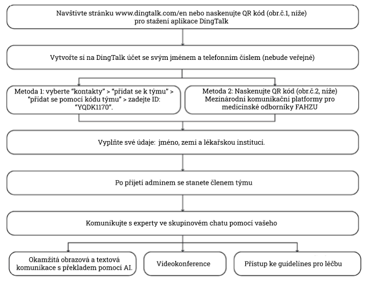

# Dodatek

## Ukázková léčebná opatření pro pacienta s COVID-19

### Léčebná opatření pro mírné případy COVID-19

#### Běžná opatření

* Izolace \(vzduch\), monitorace saturace kyslíku v krvi, kyslíková terapie kyslíkovými brýlemi

#### Vyšetření

* Sputum a stolici vyšetřit na přítomnost 2019 Novel Coronavirus RNA \(Three Sites\) -- 1x denně

* Krevní obraz, biochemický profil, vyšetření moči a stolice \(vč. okultního krvácení\), vyšetření koagulačních parametrů + D-dimerů, analýza krevních plynů \(ASTRUP\), laktát, ASLO, RF, CRP, anti-CCP Ig, sedimentace, prokalcitonin, krevní skupiny ABO+Rh faktor, funkce štítné žlázy, srdeční enzymy vč. sérového troponinu kvantitativně, Four Routine Items test \(koagulace\), test na respirační viry, cytokiny, G/GM test, angiotenzin konvertující enzym

* UZ jater, žlučníku, pankreatu a sleziny, echokardiografie a CT plic

#### Medikace

* Arbidol tabety, 200 mg, p.o., 3x denně
* Lopinavir/Ritonavir, 2 tbl, p.o., po 12 hodinách
* Interferon sprej, 1 vdech, 3x denně

### Léčebná opatření pro středně těžké případy COVID-19

#### Běžná opatření

* Izolace \(vzduch\), monitorování saturace krve kyslíkem, kyslíková terapie kyslíkovými brýlemi

#### Vyšetření

* Sputum a stolici vyšetřit na přítomnost 2019 Novel Coronavirus RNA \(Three Sites\), 1x denně

* Krevní obraz, biochemický profil, vyšetření moči a stolice \(vč. okultního krvácení\), vyšetření koagulačních parametrů + D-dimery, analýza krevních plynů \(ASTRUP\), laktát, ASLO, RF, CRP, anti-CCP Ig, sedimentace, prokalcitonin, krevní skupiny ABO+Rh, funkce štítné žlázy, srdeční enzymy vč. sérového troponinu kvantitativně, Four Routine Items test \(koagulace\), test na respirační viry, cytokiny, G/GM test, angiotenzin konvertující enzym

* UZ jater, žlučníku, pankreatu a sleziny, echokardiografie a CT plic
   
#### Medikace

* Arbidol tablety, 200 mg, p.o., 3x denně
* Lopinavir/Ritonavir, 2 tablety, p.o., po 12 hodinách
* Interferon sprej, 1 vdech, 3x denně
* Ambroxol, 30 mg v 100 ml fyz. roztoku, i.v. vykapat, 2x denně

### Léčebná opatření pro těžké případy COVID-19

#### Běžná opatření

* Izolace \(vzduch\), monitorování saturace krve kyslíkem, kyslíková terapie kyslíkovými brýlemi

#### Vyšetření

* Sputum a stolici vyšetřit na přítomnost 2019 Novel Coronavirus RNA \(Three Sites\) 1x denně

* Krevní obraz, biochemický profil, vyšetření moči a stolice \(vč. okultního krvácení\), vyšetření koagulačních parametrů + D-dimery, analýza krevních plynů \(ASTRUP\), laktát, ASLO, RF, CRP, anti-CCP Ig, sedimentace, prokalcitonin, krevní skupiny ABO+Rh, funkce štítné žlázy, srdeční enzymy vč. sérového troponinu kvantitativně, Four Routine Items test \(koagulace\), test na respirační viry, cytokiny, G/GM test, angiotenzin konvertující enzym

* UZ jater, žlučníku, pankreatu a sleziny, echokardiografie a CT plic

#### Medikace

* Arbidol tablety, 200 mg, 3x denně
* lopinavir/ritonavir, 2 tablety, po 12 hodinách
* Interferon sprej, 1 vdech, 3x denně
* methylprednisolon, 40 mg v 100 ml fyz. roztoku, i.v. vykapat, denně
* pantoprazol, 40 mg v 100 ml fyz. roztoku, i.v. vykapat, denně
* Caltrate, 1 tableta, denně
* imunoglobuliny, 20 g, i.v. vykapat, denně
* Ambroxol, 30 mg v 100 ml fyz. roztoku, i.v. vykapat, 2x denně

### Léčebná opatření pro kritické případy COVID-19

#### Běžná opatření

* Izolace \(vzduch\), monitorování saturace krve kyslíkem, kyslíková terapie kyslíkovými brýlemi

#### Vyšetření

* Sputum a stolici vyšetřit na přítomnost 2019 Novel Coronavirus RNA \(Three Sites\)denně

* Krevní obraz, krevní skupina ABO+Rh, vyšetření moči a stolice \(vč. okultního krvácení\), Four Routine Items test \(koagulace\), test na respirační viry, funkce štítné žlázy, elektrokardiogram \(EKG\), analýza krevních plynů \(ASTRUP\), elektrolyty, laktát,, G/GM test, hemokultivace \(JEDNORÁZOVĚ\)

* Krevní obraz, biochemický profil, vyšetření koagulačních parametrů + D-dimery, analýza krevních plynů \(ASTRUP\), laktát, natriuretický peptid, srdeční enzymy vč. sérového troponinu kvantitativně, imunoglobulin + komplement, cytokiny, kultivace ze sputa, CRP, PCT denně

* glykémie po 6 hodinách
  
* UZ jater, žlučníku, slinivky a sleziny, echokardiografie \(EKG\) a CT plic

#### Medikace

* Arbidol tablety, 200 mg, p.o., 3x denně
* lopinavir/ritonavir, 2 tablety, po 12 h \(nebo darunavir 1 tableta denně\)
* methylprednisolon, 40 mg v 10 ml fyz. roztoku, i.v., po 2 hodinách
* pantoprazol 40 mg v 100 ml fyz. roztoku, i.v. vykapat, denně
* imunoglobuliny, 20 g, i.v. vykapat, denně
* thymické peptidy, 1,6 mg, s.c., 2x týdně \[Pozn. překl.: např. Zadaxin\]
* Ambroxol, 30 mg v 10 ml fyz. roztoku, i.v., 2x denně
* isoproterenol, 2 mg v 100 ml fyz. roztoku, i.v.- vp jednorázově \[Pozn. překl.: nebulizace?\]
* lidský sérový albumin, 10 g, i.v. vykapat, denně
* piperacillin/tazobactam, 4,5 v 100 ml fyz. roztoku, i.v. vykapat, po 8 hodinách
* parenterální výživa v suspenzi \(př. Peptisorb liquid\), 500 ml, nasogastrickou sondou

## Postup online konzultace pro diagnostiku a léčbu

### Online konzultace pro diagnostiku a léčbu

**Instrukce pro Internetovou nemocnici FAHZU**

Neváhejte nás kontaktovat:

E-mail: zdyy66l6@l26.com, zyinternational@l63.com

#### Online platforma komunikace pro lékaře

**Instrukce pro Mezinárodní komunikační platformu pro medicínské odborníky od First Affiliated Hospital, Zhejiang university School of Medicine**

* Obr.1: Naskenujte pro stažení aplikace DingTalk
* Obr.2: QR kód pro FAHZU komunikační platformu
* Obr.3: Uživatelská příručka

_Poznámka: Naskejte QR kód z obr.3. pro stažení uživatelské příručky_

