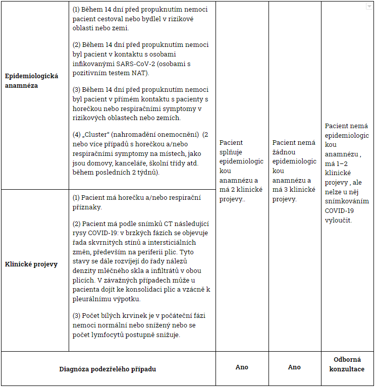
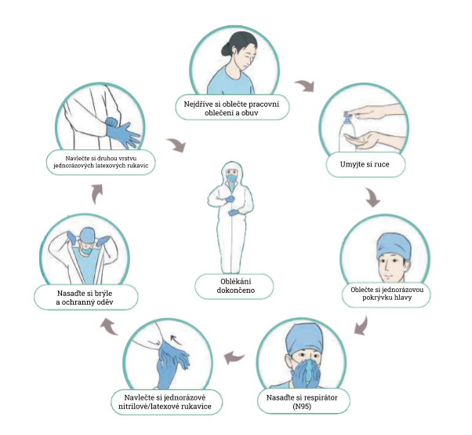

# ČÁST 1: Prevence a kontrola řízení

## Správa izolačních oblastí

### Klinika pro pacienty s horečkou

#### Plán rozvržení

1. Zdravotnické zařízení musí vytvořit nebo vyčlenit relativně nezávislou samostatnou kliniku pro pacienty s horečkou včetně samostatného jednosměrného průchozího koridoru přímo u vchodu do nemocnice s viditelným označením.
2. Pohyb osob se řídí zásadou „tří zón a dvou průchodů": kontaminovaná zóna, potenciálně kontaminovaná zóna a čistá zóna zřetelně ohraničená a dvě přechodové zóny mezi kontaminovanou a potenciálně kontaminovanou zónou.
3. Pro přenášení kontaminovaných předmětů musí být vytvořen nezávislý průchod; vytvořte označený průchod pro jednosměrné doručování předmětů z kancelářské oblasti \(potenciálně kontaminovaná zóna\) na izolační oddělení \(kontaminovaná zóna\).
4. Pro zdravotnické pracovníky by měly být standardizovány vhodné postupy oblékání a svlékání osobních ochranných pracovních prostředků. Vytvořte mapy a vývojové diagramy jednotlivých zón, nainstalujte zrcadla zobrazující celou postavu a striktně dodržujte všechny trasy pro chůzi.
5. Jmenujte technické pracovníky pro prevenci infekce a kontrolu, kteří budou dohlížet na to, jak si zdravotničtí pracovníci oblékají a svlékají osobní ochranné pracovní prostředky , aby nedošlo ke kontaminaci.
6. Všechny předměty v kontaminované zóně, které nebyly vydezinfikovány, nesmí zónu opustit.

#### Uspořádání zón

1. Vytvořte samostatnou vyšetřovací místnost , laboratoř, observační místnost a resuscitační místnost.
2. Vytvořte oblast pro umístění pacientů před vyšetřením a jejich třídění, kde bude prováděn předběžný screening pacientů.
3. Oddělte zóny pro diagnózu a léčbu: pacienty s epidemiologickou anamnézou a horečkou a/nebo respiračními symptomy nasměrujte do zóny pro pacienty s podezřením na COVID-19. Pacienty s běžnou horečkou, ale bez jasné epidemiologické anamnézy, nasměrujte do zóny pro pacienty s běžnou horečkou.

#### Edukace pacientů

1. Pacienti s horečkou musí nosit lékařské ústenky.
2. Do čekárny mohou vstupovat pacienti tak, aby nedocházelo k jejímu přeplnění.
3. Délka návštěvy pacienta by měla být minimalizována, aby se zabránilo přenosu infekcí.
4. Poučte pacienty a jejich rodiny o včasné identifikaci symptomů a nejdůležitějších preventivních opatřeních.

#### Vyšetřování, příjem pacientů a vyloučení infekce

1. Všichni zdravotničtí pracovníci musí zcela rozumět epidemiologickým a klinickým charakteristikám COVID-19 a vyšetřovat pacienty v souladu s níže uvedenými vyšetřovacími kritérii \(viz Tabulka 1\).
2. U pacientů, kteří splňují vyšetřovací kritéria pro podezření na COVID-19, se provádí testování nukleové kyseliny \(NAT\).
3. U pacientů, kteří nesplňují výše uvedená vyšetřovací kritéria a nemají potvrzenou epidemiologickou anamnézu , ale nelze u nich vyloučit onemocnění COVID-19 vzhledem k jejich symptomům, především prostřednictvím lékařských zobrazovacích metod , se doporučuje další vyhodnocení a vytvoření komplexní diagnózy.
4. Každý pacient, který má negativní výsledek testu, musí být znovu testován za 24 hodin. Pokud má pacient dva negativní výsledky testu NAT a negativní klinické projevy, lze u něj vyloučit onemocnění COVID-19 a propustit ho z nemocnice. Pokud u těchto pacientů nelze na základě jejich klinických manifestací infekci COVID-19 vyloučit, je nutné u nich provádět další testy NAT, dokud nebude onemocnění potvrzeno nebo vyloučeno.
5. Potvrzené případy s pozitivním výsledkem testu NAT je nutné hospitalizovat a kolektivně léčit v závislosti na závažnosti jejich stavu \(obecné izolační oddělení nebo izolovaná JIP\).

### Vyšetřovací kritéria pro pacienty s podezřením na COVID-19

### Izolační oddělení

#### Rozsah použití

Izolační oddělení zahrnují observační část oddělení, vlastní izolační oddělení a izolační JIP. Rozvržení budovy a pracovní postupy \(izolační režim\) musí splňovat relevantní požadavky technických předpisů v oblasti nemocniční izolace. Poskytovatelé zdravotních služeb s místnostmi s podtlakem by měli implementovat standardizované řízení provozu v souladu s příslušnými požadavky. Přístup na izolační oddělení přísně omezte.

#### Plán rozložení

Viz klinika pro pacienty s horečkou.

#### Požadavky na oddělení

1. Pacienti s podezřením na COVID-19 a potvrzení pacienti musí být od sebe odděleni v různých částech oddělení.
2. Pacienti s podezřením na COVID-19 musí být izolování na samostatných pokojích pro jednu osobu. Každý pokoj musí být vybaven např. vlastní koupelnou a aktivita pacienta by měla být omezena na izolační oddělení.
3. Potvrzení pacienti na COVID-19 mohou být umístěni do stejného pokoje s minimálním rozestupem mezi lůžky 1,2 m. Pokoj musí být vybaven koupelnou a aktivita pacientů musí být omezena na izolační oddělení.

#### Edukace pacientů

1. Návštěvy rodinných příslušníků a ošetřovatelů nesmí být dovoleny. Pacienti by měli mít možnost mít u sebe svá elektronická komunikační zařízení, aby mohli komunikovat s blízkými.
2. Poučte pacienty, abyste jim pomohli zabránit dalšímu šíření COVID-19, a poskytněte jim pokyny ohledně způsobu nošení lékařských ústenek , řádného mytí rukou, etikety při kašli , zdravotnického pozorování a domácí karantény.

## Management personálu

### Pracovní postup

1. Před zahájením práce na vyčleněné klinice pro pacienty s horečkou a na izolačním oddělení musí být personál podroben důkladnému školení a zkoušce v oblékání a svlékání osobních ochranných pracovních prostředků. . Těmito zkouškami musí projít před tím, než jim bude povoleno na těchto odděleních pracovat.
2. Zaměstnanci by měli být rozděleni do různých týmů. Každý tým by měl na infekčním izolačním oddělení pracovat maximálně po dobu 4 hodin. Týmy by měly pracovat na infekčních izolačních odděleních \(kontaminovaných zónách\) v odlišných časech.
3. Zajistěte péči, vyšetření a dezinfekci pro každý tým jakožto skupinu, aby se snížila frekvence zaměstnanců pohybujících se dovnitř a ven z izolačního oddělení.
4. Před skončením služby se zaměstnanci musí umýt a provést nezbytnou osobní hygienu, aby se zabránilo možné infekci jejich dýchacích cest a sliznic.

### Řízení zdraví

1. Zaměstnanci v první linii v izolačních oblastech -- včetně zdravotnických pracovníků, ošetřujících pracovníků a pracovníků logistiky a správy majetku -- by měli žít v izolovaném ubytování a neměli by vycházet ven bez povolení.
2. Lékařským pracovníkům by měla být podávána výživná strava, aby podpořila jejich imunitu.
3. Sledujte a evidujte zdravotní stav všech zaměstnanců ve službě a provádějte sledování zdravotního stavu zaměstnanců v přední linii, včetně sledování tělesné teploty a respiračních příznaků ; pomáhejte směřovat jakékoliv psychologické či fyziologické problémy zaměstnanců na příslušné odborníky.
4. Pokud mají zaměstnanci relevantní příznaky jako je horečka, měli by být ihned izolováni a otestováni testem NAT.
5. Pokud zaměstnanci v první linii včetně zdravotnických pracovníků, ošetřujících pracovníků a pracovníků logistiky a správy majetku skončí práci v izolačních oblastech a vrací se do normálního života, měli by být nejdříve otestováni testem NAT na SARS-Cov-2. Pokud je test negativní, měli by být před propuštěním z lékařského dohledu společně izolováni v určeném místě po dobu 14 dní.

## Řízení ochrany osob v souvislosti s COVID-19

<table>
  <thead>
    <tr>
      <th style="text-align:left">&#xDA;rove&#x148; ochrany</th>
      <th style="text-align:left">Ochrann&#xE9; prost&#x159;edky</th>
      <th style="text-align:left">Rozsah pou&#x17E;it&#xED;</th>
    </tr>
  </thead>
  <tbody>
    <tr>
      <td style="text-align:left">I. &#xFA;rove&#x148; ochrany</td>
      <td style="text-align:left">
        <ul>
          <li>jednor&#xE1;zov&#xE1; chirurgick&#xE1; &#x10D;epice</li>
          <li>jednor&#xE1;zov&#xE1; l&#xE9;ka&#x159;sk&#xE1; &#xFA;stenka</li>
          <li>pracovn&#xED; uniforma</li>
          <li>jednor&#xE1;zov&#xE9; latexov&#xE9; rukavice nebo v p&#x159;&#xED;pad&#x11B;
            nutnosti jednor&#xE1;zov&#xFD; ochrann&#xFD; zdravotnick&#xFD; oblek</li>
        </ul>
      </td>
      <td style="text-align:left">
        <ul>
          <li>tri&#xE1;&#x17E; p&#x159;ed vy&#x161;et&#x159;en&#xED;m, odd&#x11B;len&#xED;
            ambulantn&#xED; p&#xE9;&#x10D;e</li>
        </ul>
      </td>
    </tr>
    <tr>
      <td style="text-align:left">II. &#xFA;rove&#x148; ochrany</td>
      <td style="text-align:left">
        <ul>
          <li>jednor&#xE1;zov&#xE1; chirurgick&#xE1; &#x10D;epice</li>
          <li>respir&#xE1;tor t&#x159;&#xED;dy FFP3 (N95)</li>
          <li>pracovn&#xED; uniforma</li>
          <li>jednor&#xE1;zov&#xFD; ochrann&#xFD; zdravotnick&#xFD; oblek</li>
          <li>jednor&#xE1;zov&#xE9; latexov&#xE9; rukavice</li>
          <li>ochrann&#xE9; br&#xFD;le</li>
        </ul>
      </td>
      <td style="text-align:left">
        <ul>
          <li>odd&#x11B;len&#xED; ambulantn&#xED; p&#xE9;&#x10D;e pro pacienty s hore&#x10D;kou</li>
          <li>izola&#x10D;n&#xED; odd&#x11B;len&#xED; (v&#x10D;etn&#x11B; izola&#x10D;n&#xED;
            JIP)</li>
          <li>vy&#x161;et&#x159;en&#xED; nerespira&#x10D;n&#xED;ch vzork&#x16F; pacient&#x16F;
            s podez&#x159;en&#xED;m/pozitivn&#xED;m n&#xE1;lezem</li>
          <li>vy&#x161;et&#x159;en&#xED; diagnostickou zobrazovac&#xED; metodou pacient&#x16F;
            s podez&#x159;en&#xED;m/pozitivn&#xED;m n&#xE1;lezem</li>
          <li>&#x10D;i&#x161;t&#x11B;n&#xED; chirurgick&#xFD;ch n&#xE1;stroj&#x16F;
            pou&#x17E;it&#xFD;ch na pacientech s podez&#x159;en&#xED;m/pozitivn&#xED;m
            n&#xE1;lezem</li>
        </ul>
      </td>
    </tr>
    <tr>
      <td style="text-align:left">III. &#xFA;rove&#x148; ochrany</td>
      <td style="text-align:left">
        <ul>
          <li>jednor&#xE1;zov&#xE1; chirurgick&#xE1; &#x10D;epice</li>
          <li>respir&#xE1;tor t&#x159;&#xED;dy FFP3 (N95)</li>
          <li>pracovn&#xED; uniforma</li>
          <li>jednor&#xE1;zov&#xFD; ochrann&#xFD; zdravotnick&#xFD; oblek</li>
          <li>jednor&#xE1;zov&#xE9; latexov&#xE9; rukavice</li>
          <li>celoobli&#x10D;ejov&#xE1; ochrann&#xE1; respira&#x10D;n&#xED; maska nebo
            respir&#xE1;tor s automatick&#xFD;m &#x10D;i&#x161;t&#x11B;n&#xED;m vzduchu</li>
        </ul>
      </td>
      <td style="text-align:left">
        <ul>
          <li>p&#x159;i prov&#xE1;d&#x11B;n&#xED; z&#xE1;krok&#x16F;, jako nap&#x159;.
            trache&#xE1;ln&#xED; intubace, tracheostomie, bronchofibroskopie, gastroenterologick&#xE1;
            endoskopie apod., b&#x11B;hem kter&#xFD;ch mohou pacienti s podez&#x159;en&#xED;m/pozitivn&#xED;m
            n&#xE1;lezem vyka&#x161;l&#xE1;vat &#x10D;i vylu&#x10D;ovat respira&#x10D;n&#xED;
            sekrety &#x10D;i t&#x11B;lesn&#xE9; tekutiny/krev</li>
          <li>p&#x159;i prov&#xE1;d&#x11B;n&#xED; operac&#xED; a pitev pacient&#x16F;
            s podez&#x159;en&#xED;m/pozitivn&#xED;m n&#xE1;lezem</li>
          <li>p&#x159;i prov&#xE1;d&#x11B;n&#xED; amplifikace nukleov&#xFD;ch kyselin
            COVIDu-19</li>
        </ul>
      </td>
    </tr>
  </tbody>
</table>**Poznámky:**

1. Veškerý personál zdravotnického zařízení musí nosit lékařské ústenky \(chirurgické roušky\)
2. Veškerý personál urgentního příjmu, ambulantního oddělení infekčních chorob, ambulantního oddělení respirační péče, stomatologického oddělení či ordinací provádějících endoskopická vyšetření \(např. gastrointestinální endoskopii, bronchofibroskopii, laryngoskopii, atd.\) musí podle Úrovně ochrany I přejít z chirurgických roušek na respirátor třídy FFP3 \(N95\).
3. Personál musí při sběru respiračních vzorků od pacientů s podezřením/pozitivním nálezem podle Úrovně ochrany II nosit ochranné obličejové štíty.

## Postupy pro nemocniční praxi v průběhu epidemie COVID-19

### Doporučené postupy pro oblékání a svlékání osobních ochranných pracovních prostředků určených k péči o pacienty s COVID-19

**Protokol na oblékání osobních ochranných pracovních prostředků:**

1. Oblečte si pracovní oblečení a obuv 
2. Umyjte si ruce 
3. Oblečte si jednorázovou pokrývku hlavy 
4. Nasaďte si respirátor \(N95\) 
5. Navlečte si jednorázové nitrilové/latexové rukavice 
6. Nasaďte si brýle a ochranný oděv \(poznámka: pokud máte ochranný oděv bez návleků na obuv nasaďte si samostatné voděodolné návleky na obuv\), oblečte si jednorázový empír \(pokud je v pracovní oblasti požadován\) a obličejový štít/celoobličejovou masku \(pokud jsou v pracovní oblasti požadovány\) 
7. Navlečte si druhou vrstvu jednorázových latexových rukavic

**Protokol na svlékání osobních ochranných pracovních prostředků:**

1. Umyjte si ruce a odstraňte viditelné stopy kontaminace tělesnými tekutinami/krví na povrchu obou rukou 
2. Umyjte si ruce a nahraďte vnější vrstvu rukavic novými rukavicemi 
3. Odstraňte obličejový štít/celoobličejovou masku \(pokud jste je používali\) 
4. Umyjte si ruce 
5. Svlékněte si jednorázový empír a vnější vrstvu rukavic \(pokud jste je používali\) 
6. Umyjte si ruce a navlékněte si nové rukavice 
7. Umyjte si ruce a svlékněte si ochranný oděv a vnější vrstvu rukavic \(při svlékání rukavic a ochranného oděvu je otočte naruby\) \(poznámka: pokud jste je používali, svlékněte si jednorázové návleky na obuv spolu s ochranným oděvem\) 
8. Umyjte si ruce 
9. Umyjte si ruce a sundejte si brýle 
10. Umyjte si ruce a sundejte si respirátor 
11. Umyjte si ruce a sundejte si pokrývku hlavy 
12. Umyjte si ruce a svlékněte si vnitřní jednorázové latexové rukavice 
13. Umyjte si ruce, osprchujte se, oblečte si čisté oblečení a vstupte do čisté oblasti

### Postupy pro dezinfekci izolačních oddělení pro pacienty s COVID-19

#### Dezinfekce podlah a stěn

1. Viditelné stopy krve/tělesných tekutin znečišťující povrchy musí být před dezinfekcí odstraněny \(podle postupu pro likvidaci krve/tělesných tekutin\);
2. Dezinfikujte podlahy a stěny pomocí chlorové dezinfekce \(obsah aktivního chloru 1000 mg/l\) vytíráním podlahy, postřikem nebo setřením;
3. Ujistěte se, že dezinfekce je na podlahách a stěnách alespoň 30 minut;
4. Dezinfikujte oblast třikrát denně a postup opakujte vždy, když dojde ke kontaminaci

#### Dezinfekce povrchu předmětů

1. Viditelné stopy krve/tělesných tekutin znečišťující povrchy musí být před dezinfekcí odstraněny \(podle postupu pro likvidaci krve/tělesných tekutin\);
2. Otřete povrchy předmětů chlorovým dezinfekčním prostředkem \(obsah aktivního chloru 1000 mg/l\) nebo ubrousky obsahující chlor a ponechte působit 30 minut k plnému účinku dezinfekce, poté se povrch utře čistou vodou. Dezinfekce se provádí třikrát denně \(a vždy když máme podezření na kontaminaci\);
3. Nejdříve otřeme čistější oblasti, poté oblasti více kontaminované: nejdříve otřeme oblasti, kterých se méně dotýkáme, poté oblasti, kterých se dotýkáme často. \(Když je povrch předmětu čistě otřen, vyměníme špinavý ubrousek ubrouskem čistým\).

#### Dezinfekce vzduchu

1. V prostředí s lidskou aktivitou můžeme pro dezinfekci vzduchu použít a nechat nepřetržitě zapnutý plazmový sterilizátor;
2. Pokud nemáte plazmový sterilizátor, použijte germicidní UV lampy vždy na jednu hodinu. Postup opakujte třikrát denně.

#### Likvidace fekálií a odpadu

1. Před vypuštěním fekálií a odpadu do městské kanalizace musí dojít k jejich dezinfekci. K dezinfekci použijeme chlorovou dezinfekci \(obsah aktivního chloru alespoň 40 mg/l\). Čas po který dezinfekce působí je alespoň 1,5 hodiny;
2. Koncentrace celkového zbytku chloru v dezinfikovaném odpadu by měla dosáhnout 10 mg/l.

### Likvidace rozlitého biologického materiálu \(krve/tělesných tekutin\) u pacientů s COVID-19

#### Pro rozlitý biologický materiál o menším objemu \(&lt; 10 ml\) krve/tělních tekutin

**První možnost:** Biologický materiál by měl být přikryt dezinfekčními ubrousky na bázi chlóru \(s obsahem 5000 mg/l efektivního chlóru\) a opatrně odstraněn, následně by měl být povrch znečištěného předmětu dvakrát otřen dezinfekčními ubrousky na bázi chlóru \(s obsahem 500 mg/l efektivního chlóru\);

**Druhá možnost:** Opatrné odstranění biologického odpadu jednorázovým savým materiálem \(např. gázou, ubrouskem atd.\), který byl namočen do dezinfekčního roztoku na bázi chlóru \(s obsahem 5000 mg/l efektivního chlóru\)

#### Pro rozlitý biologický materiál o větším objemu \(&gt; 10 ml\) krve/tělních tekutin

Nejprve umístěte upozornění, kterým vyznačíte prostor potřísněný biologickým odpadem

Zrealizujte likvidaci na základě první nebo druhé možnosti popsané níže:

1. **První možnost:** nechte absorbovat rozlité tekutiny po dobu 30 minut čistým savým ručníkem \(obsahujícím kyselinu peroxyoctovou, která absorbuje až 1 litr tekutiny na ručník\) a pak vyčistěte kontaminovanou oblast po odstranění znečišťujícího materiálu.
2. **Druhá možnost:** kompletně pokryjte znečištěnou oblast dezinfekčním práškem nebo bělícím práškem obsahujícím ingredience absorbující vodu nebo kompletně přikryjte jednorázovými materiály absorbujícími vodu, a pak nalijte dostatečné množství dezinfekčního roztoku na bázi chloru \(s obsahem 10000 mg/l efektivního chloru\) na materiál absorbující vodu \(nebo přikryjte suchým ručníkem, který bude vystaven intenzivní dezinfekci\). Nechte působit alespoň 30 minut, než opatrně odstraníte rozlitý biologický materiál.

   Pacientova stolice, sekrety, zvratky apod. by měly být sbírány do speciální nádoby a dezinfikovány po dobu 2 hodin dezinfekcí na bázi chloru \(s obsahem 20000 mg/l efektivního chloru\) v poměru biologického materiálu k dezinfekci 1:2.

   Po odstranění biologického znečištění vydezinfikujte povrchy znečištěného prostředí a předmětů.

   Nádoby na schraňování biologického materiálu je třeba ponořit do dezinfekce na bázi chloru \(s obsahem 5000 mg/l efektivního chloru\) po dobu 30 minut a následně očistit.

   Sesbíraný biologický materiál musí být likvidován jako zdravotnický infekční odpad.

   Použité vybavení by mělo být umístěno do dvouvrstvých pytlů na zdravotnický infekční odpad a zlikvidován jako zdravotnický infekční odpad.

### Dezinfekce opakovaně používaných osobních ochranných pracovních prostředků v rámci COVID-19

#### Dezinfekce nabíjecího respirátoru pro čištění vzduchu

**Upozornění:** Postup dezinfekce ochranného krytu je použitelný jen pro kryty na opakované použití \(nikoliv pro jednorázové kryty\)

#### Čištění a dezinfekce pro endoskopy trávicího traktu a bronchofibroskopy

1. Ponoř endoskop a ventily na opakované použití v 0,23% kyselině peroxyoctové \(ověř koncentraci dezinfekčního roztoku před použitím, aby ses ujistil o jeho účinnosti\);
2. Připoj perfuzní hadici do každé kanálu endoskopu, vstříkni 50 ml injekční stříkačkou 0,23% kyselinu peroxyoctovou dokud není plně naplněna hadice a počkej 5 minut;
3. Odpoj perfuzní hadici a vypláchni každou dutinu a ventil endoskopu jednorázovým speciálním kartáčkem;
4. Umísti ventily do ultrasonického oscilátoru s obsahem enzymů a nech oscilovat.
5. Připoj perfuzní hadici každého kanálu endoskopu. Vstříkni 0,23% kyselinu peroxyoctovou do hadice 50 ml injekční stříkačkou a kontinuálně proplachuj hadici 5 minut. Vstřikuj vzduch na sušení 1 minutu;
6. Vstříkni čistou vodu do hadice 50 ml injekční stříkačkou a kontinuálně proplachuj hadici 3 minuty. Vstřikuj vzduch na sušení 1 minutu;
7. Proveď test těsnosti endoskopu;
8. Vlož do automatické endoskopické dezinfekční myčky. Nastav program s vysokou mírou dezinfikování.
9. Odešli vybavení do centrální sterilizační jednotky ke sterilizaci etylenoxidem.

#### Dekontaminace opakovaně používaných nástrojů a zdravotnických pomůcek

1. Není-li žádné viditelné znečištění, ponoř vybavení do dezinfekčního roztoku na bázi chloru \(s obsahem 1000 mg/l efektivního chloru\) na alespoň 30 minut;
2. Pokud je patrné jakékoliv znečištění, ponoř vybavení do dezinfekčního roztoku na bázi chloru \(s obsahem 5000 mg/l efektivního chloru\) na alespoň 30 minut;
3. Po vysušení zabalte a důkladně utěsněte vybavení a odešlete do centrální sterilizační jednotky k dezinfekci/sterilizaci.

### Dezinfekční postupy pro infekční prádlo od pravděpodobných nakažených a potvrzených nakažených pacientů

#### Infekční prádlo

1. Oblečení, prostěradla, povlečení včetně polštáře použité pacienty;
2. Látkové zástěny rozdělující postele na oddělení;
3. Textilie používané na úklid okolí pacienta.

#### Postup sběru

1. Nejdříve zabalte všechny textilie do jednorázového plastového obalu, který se uzavře stahovací páskou;
2. Poté uzavřený pytel vložíme do dalšího plastového pytle, který se znovu uzavře stahovací páskou;
3. Nakonec zabalený, uzavřený pytel vložíme do látkového pytle na prádlo a uzavřeme stahovací páskou;
4. K pytli přiložíme speciální označení pro infekční materiál a název oddělení, ze kterého pytel pochází a pošleme ho do prádelny.

#### Skladování a praní

1. Infekční prádlo by se mělo oddělit od jiného infekčního prádla \(non-COVID-19\) a prát ve vyhrazené pračce k tomu určené;
2. Perte a dezinfikujte prádlo za použití chlorové dezinfekce na 90 °C alespoň 30 minut.

#### Dezinfekce přepravních prostředků

1. Pro přepravu infekčního prádla by měly být využity speciální přepravní prostředky;
2. Tyto prostředky by měly být po každém převozu infekčního prádla ihned dezinfikovány;
3. Transportní pomůcky by měly být otřeny chlorovým dezinfekčním prostředkem ihned po použití \(s obsahem 1000 mg/l aktivního chloru\). Dezinfekce se nechá působit 30 minut, poté se povrch setře čistou vodou.

### Postup likvidace infekčního odpadu \(souvisejícího s nákazou COVID-19\)

1. Všechen odpad vytvořený v souvislosti s péčí o pravděpodobně nakažené a potvrzené nakažené pacienty by měl být likvidován jako infekční odpad;
2. Vložte odpad do dvouvrstvého speciálního pytle na infekční odpad, pytel uzavřete pomocí stahovacích pásek a celý ho opláchněte/postříkejte chlorovým dezinfekčním prostředkem \(obsah aktivního chloru 1000 mg/l\);
3. Ostré předměty vložte do nádoby na zdravotnický odpad, nádobu uzavřete a opláchněte/postříkejte chlorovým dezinfekčním prostředkem \(obsah aktivního chloru 1000 mg/l\);
4. Zabalený odpad vložte do nádoby určené k přepravě infekčního odpadu, přiložte speciální označení infekčního materiálu, nádobu uzavřete a přepravte;
5. Odpad má být přepraven předem určenou cestou v určitý čas na místo dočasného skladování infekčního odpadu;
6. Infekční odpad následně odveze a zlikviduje firma specializující se na likvidaci infekčního odpadu.

### Postup pro přijímání nápravných opatření proti pracovní expozici nákaze COVID-19

1. Expozice kůže: Kůže je kontaminována velkým množstvím viditelných tělních tekutin, krví, sekrecí nebo stolicí pacienta;
2. Expozice sliznic: Sliznice, jako oči nebo respirační trakt jsou kontaminovány velkým množstvím viditelných tělních tekutin, krví, sekrecí nebo stolicí pacienta;
3. Poranění ostrým předmětem: Propíchnutí kůže ostrými předměty, které byly kontaminovány velkým množstvím viditelných tělních tekutin, krví, sekrecí nebo stolicí pacienta;
4. Přímá expozice respiračního traktu: Spadnutí ochranných pomůcek, expozice úst nebo nosu v blízkosti \(1 metr\) potvrzeného pacienta, který nemá masku.

### Chirurgické výkony u pravděpodobně nakažených a potvrzených nakažených pacientů

#### Požadavky na operační sály a osobní ochranné pracovní prostředky zaměstnanců

1. Naplánujte operaci na operačním sále s podtlakem. Ověřte teplotu, vlhkost a tlak vzduchu na operačním sále;
2. Připravte všechny nástroje potřebné k operaci a pokud možno použijte jednorázové nástroje a pomůcky;
3. Chirurgický personál \(včetně chirurgů, anesteziologů, instrumentářek a vrchních sester\), který vstupuje na operační sál, by měl použít osobní ochranné pracovní prostředky před vstupem na sál: Dvojitá pokrývka hlavy, respirátor \(N95\), ochranné brýle, ochranný oblek, návleky na obuv, latexové rukavice a celoobličejovou masku;
4. Chirurgové a instrumentářky by kromě výše zmíněných ochranných pomůcek měli nosit jednorázové sterilní oblečení a sterilní rukavice;
5. Pacient by měl mít nasazenu jednorázovou pokrývku hlavy a lékařskou ústenku/chirurgickou roušku podle zdravotního stavu;
6. Určená sestra přináší na operační sál s podtlakem nástroje z prostoru umývárny;
7. Během operace jsou umývárna a operační sál pevně uzavřeny; a operace může být provedena pouze pokud je na operačním sále podtlak;
8. Vstup na operační sál je zakázán pro ostatní zdravotnický personál, který není nezbytně nutný k výkonu.

#### Postupy pro závěrečnou dezinfekci

1. Zdravotnický odpad bude likvidován jako infekční odpad spojen s nákazou COVID-19;
2. Nástroje pro opakované použití budou dezinfikovány podle pravidel k dezinfekci znovu použitelných nástrojů spojených s virem SARS-CoV-2;
3. Zdravotnické prádlo bude dezinfikováno a likvidováno podle pravidel k dezinfekci infekčního prádla při infekci virem SARS-CoV-2;
4. Povrchy předmětů \(nástroje a zařízení včetně operačního stolu, stolu na nástroje, postele atd.\):
   1. Viditelné stopy krve/tělesných tekutin znečišťující povrchy musí být před dezinfekcí odstraněny \(podle postupu pro likvidaci krve/tělesných tekutin\).
   2. Všechny povrchy se otírají chlorovým dezinfekčním prostředkem \(obsah aktivního chloru 1000 mg/l\) a počkat 30 minut k plnému účinku dezinfekce.
5. Podlahy a stěny:
   1. Viditelné stopy krve/tělesných tekutin znečišťující povrchy musí být před dezinfekcí odstraněny \(podle postupu pro likvidaci krve/tělesných tekutin\).
   2. Všechny povrchy se otírají chlorovým dezinfekčním prostředkem \(obsah aktivního chloru 1000 mg/l\) a počkat 30 minut k plnému účinku dezinfekce.
6. Vzduch v místnosti: Vypněte vzduchotechniku. Dezinfikujte vzduch pomocí UV lampy alespoň 1 hodinu. Zapněte vzduchotechniku k automatickému vyčištění vzduchu alespoň na 2 hodiny.

### Postupy k zacházení s těly zemřelých pravděpodobně nakažených nebo potvrzených pacientů

1. Ochranné pomůcky personálu: Personál musí být plně chráněn nošením pracovního oděvu, jednorázovou pokrývkou hlavy, jednorázovými rukavicemi a dlouhými tlustými gumovými rukavicemi, jednorázovým ochranným oblekem, respirátorem \(N95\) nebo celoobličejovou maskou, ochranným obličejovým štítem, pracovní obuví nebo gumovou obuví, voděodolné návleky na obuv, voděodolné zástěry, atd.;
2. Manipulace s tělem zemřelého: Zaplňte všechny otvory nebo rány, které pacient má \(ústa, nos, uši, anální otvor a tracheostomický otvor\) použitím vatových tamponů nebo gázy namočených v chlorové dezinfekci \(obsah aktivního chloru 3000-5000 mg/l\) nebo 0,5% kyselině peroxyoctové;
3. Zabalení: Zabalte tělo zemřelého do dvouvrstvého látkového prostěradla namočeného v dezinfekci a poté zabalte do dvouvrstvého, uzavřeného, nepropustného obalu na zemřelého napuštěného chlorovou dezinfekcí.
4. Tělo bude převezeno personálem izolačního oddělení nemocnice kontaminovanou částí a výtahem pryč z oddělení a poté co nejdříve speciálním vozidlem na určené místo ke kremaci.
5. Závěrečná dezinfekce: Proveďte závěrečnou dezinfekci oddělení a výtahu.

## Digitální podpora pro prevenci a zvládání epidemie

### Snižte riziko přenosu nákazy, když pacienti vyhledávají lékařskou pomoc

1. Vyzývejte veřejnost, aby při zdravotních potížích , které nejsou naléhavé \( např. jako léčba chronických nemocí\) komunikovala elektronicky.Tím se sníží počet návštěvníků zdravotnických zařízení, což minimalizuje riziko přenosu nákazy.
2. Pacienti, kteří musejí navštívit zdravotnická zařízení, by si měli domluvit schůzku za použití jiných prostředků včetně internetových portálů, které poskytují potřebné pokyny ohledně dopravy, parkování, času příjezdu, ochranných opatření, informací ke třídění pacientů, navigace v budově atd. Předem zjistěte obsáhlé informace od pacientů online, aby byla diagnóza a ošetření efektivnější a snížila se délka vlastní návštěvy pacienta.
3. Podporujte pacienty v tom, aby plně využívali digitální samoobslužné nástroje a zabránili tak kontaktu s ostatními, čím se sníží riziko přenosu nákazy.

### Snižte pracovní vytížení a riziko nákazy zdravotnického personálu

1. Sbírejte sdílené poznatky a zkušenosti odborníků prostřednictvím konzultací na dálku a multidisciplinárního týmu \(MDT\), abyste mohli nabídnout optimální léčbu pro složité a komplikované případy.
2. Provádějte mobilní vizity a vizity na dálku, abyste snížili zbytečné riziko vystavení nákaze a pracovní vytížení zdravotnického personálu a zároveň šetřili ochranné pomůcky.
3. Využijte elektronický přístup k aktuálním záznamům o zdravotním stavu pacientů pomocí zdravotnických QR kódů \(poznámka: každý potřebuje získat ZELENÝ kód prostřednictvím zdravotnického QR systému, aby se mohl pohybovat po městě\). Rovněž využijte online epidemiologické dotazníky, abyste poskytli pokyny pro rychlé třídění pacientů, obzvláště pacientům s horečkou či podezřením na covid-19, a zároveň efektivně bránili riziku nákazy.
4. Elektronické zdravotní záznamy pacientů na izolačních odděleních a Al systém CT zobrazení pro COVID-19 může pomoci snížit pracovní vytížení, rychle identifikovat případy s vysokým podezřením a vyhnout se přehlédnutím při diagnóze.

### Okamžitá reakce na nouzové potřeby zamezení šíření COVID-19

1. Základní digitální zdroje vyžadované nemocničním systémem na bázi cloudu umožňují bezprostřední použití informačních systémů potřebných pro nouzovou reakci na epidemii, jako např. digitální systémy vybavené pro nově zřízenou kliniku pro pacienty s horečkou, pokoje pro observaci a izolační oddělení.
2. Využijte nemocniční informační systém na bázi internetové infrastruktury pro online školení zdravotnických pracovníků a systém nasazování zaměstnanců na směny pomocí jednoho kliknutí, a pro usnadnění práce operačních a podpůrných techniků při vykonávání údržby na dálku a updatů nových funkcí pro lékařskou péči.

### FAHZU lnternet + Hospital -- Model pro zdravotní péči online

Od vypuknutí COVID 19, nemocnice FAHZU Internet + Hospital rychle přešla k poskytování online zdravotní péče pomocí online zdravotnické platformy Zhejiang\'s Online Medical Platform s 24hodinovou online konzultací zdarma, čímž poskytuje lékařské služby na dálku pacientům v Číně a dokonce po celém světě.

Pacienti mají z domova přístup k prvotřídním zdravotnickým službám FAHZU, což snižuje šance přenosu nákazy v důsledku návštěvy nemocnice. Ke 14. březnu využilo online služeb nemocnice FAHZU Internet + Hospital přes 10 000 lidí.

#### Pokyny pro online zdravotnickou platformu Zhejiang Online Medical Platform

1. Stáhněte si aplikaci Alipay;
2. Otevřete Alipay \(čínská verze\) a najděte \"Zhejiang Provincial Online Medical Platform\";
3. Vyberte nemocnici \(The First Affiliated Hospital, Zhejiang University School of Medicine\);
4. Odešlete svůj dotaz a počkejte, až Vám odpoví lékař;
5. Jakmile Vám lékař odpoví, objeví se upozornění. Pak otevřete Alipay a klikněte na Přátelé;
6. Klikněte na Zhejiang Online Medical Platform pro více podrobností a začněte s konzultací.

### Zřízení Mezinárodní odborné zdravotnické komunikační platformy nemocnice FAHZU

V důsledku rozšíření epidemie COVID-19 nemocnice FAHZU a Alibaba společně zřídili Mezinárodní odbornou zdravotnickou komunikační platformu nemocnice FAHZU s cílem zlepšit kvalitu péče a léčby a propagovat sdílení globálního informačního zdroje. Platforma umožňuje zdravotnickým odborníkům z celého světa se vzájemně propojit a sdílet své neocenitelné zkušenosti v boji proti COVID-19 pomocí systému okamžitých zpráv s překladem v reálném čase, video konferencemi na dálku atd.

#### Pokyny k Mezinárodní odborné zdravotnické komunikační platformě nemocnice FAHZU

1. Na webových stránkách [www.dingtalk.com/en](https://github.com/covid19cz/handbook/tree/31ab9a22798350154937217d546f208330ef9827/kapitoly/www.dingtalk.com/en/README.md) si stáhněte aplikaci DingTalk.
2. Uveďte osobní údaje \(jméno a telefonní číslo\) pro registraci a přihlašte se.
3. Požádejte o vstup do Mezinárodní odborné zdravotnické komunikační platformy nemocnice FAHZU: 
   1. _Metoda 1:_ Vstupte pomocí týmového kódu. Vyberte "Contacts" &gt; "Join Team" &gt; "Join by Team Code" \("Kontakty" &gt; "Vstupte do týmu" &gt; "Vstupte pomocí týmového kódu"\), poté vložte ID: 'YQDKl 170'. 
   2. _Metoda 2:_ Vstupte naskenováním QR kódu Mezinárodní odborné zdravotnické komunikační platformy nemocnice FAHZU.
4. Pro vstup vyplňte své údaje. Uveďte své jméno, zemi a zdravotnickou instituci.
5. Po schválení administrátorem se připojte do skupinového chatu FAHZU.
6. Po připojení do skupinového chatu může zdravotnický personál posílat okamžité zprávy za pomoci Al překladu, přijímat video pokyny na dálku a má přístup k instrukcím pro lékařské ošetření.

