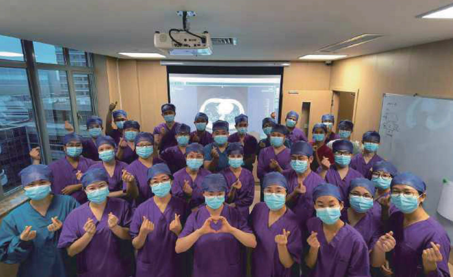
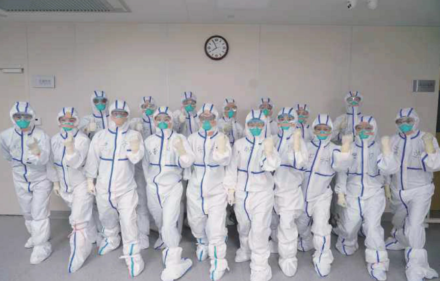

# O nemocnici FAHZU

První fakultní nemocnice při Lékařské fakultě Univerzity v Zhejiangu byla založena v roce 1947. Je to nejstarší fakultní nemocnice přidružená k Univerzitě v Zhejiangu. Se svými šesti kampusy se stala medicínským centrem, které integruje zdravotnickou péči, zdravotnické vzdělávání, vědecký výzkum a preventivní péči. V celkovém hodnocení se v rámci Číny FAHZU umístila na 14. místě.

Se svými více než 6500 zaměstnanci včetně akademických pracovníků z Čínské technické akademie a dalších mladých talentů je velkou všeobecnou nemocnicí. Celkový počet lůžek dosahuje 4000. Hlavní kampus v roce 2019 odbavil 5 milionů akutních případů a ambulantních ošetření.

V průběhu let FAHZU úspěšně vyvinula množství uznávaných programů orgánové transplantace, onemocnění slinivky, infekční onemocnění, hematologie, nefrologie, urologie, klinické farmacie atd. FAHZU pomáhá pacientům překonat rakovinu a užívat si znovu života. FAHZU je také integrovaným poskytovatelem transplantace jater, slinivky, plic, ledvin, střev a srdce. V boji proti SARS, H7N9 \(ptačí chřipce\) a COVID-19 získala bohaté zkušenosti a úspěšné výsledky. Díky tomu její zdravotničtí pracovníci mohli publikovat v časopisech jako je New England Journal of Medicine, the Lancet či Nature and Science.

FAHZU se široce zapojila do mezikontinentální výměny a spolupráce. Navázala partnerství s více než 30 prestižními univerzitami po celém světě. Výsledků také dosáhla výměnou zdravotnických odborníků a technologií s Indonésií, Malajsií a dalšími zeměmi.

V souladu se svými hlavními hodnotami -- hledání pravdy a rozvážnost -- nabízí FAHZU kvalitní zdravotní péči všem potřebným.

